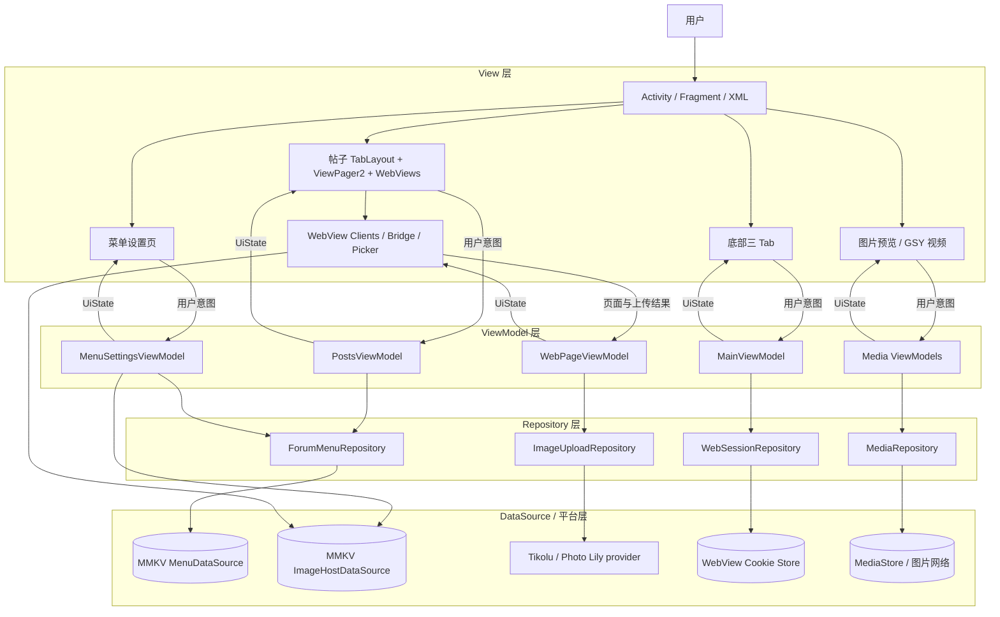
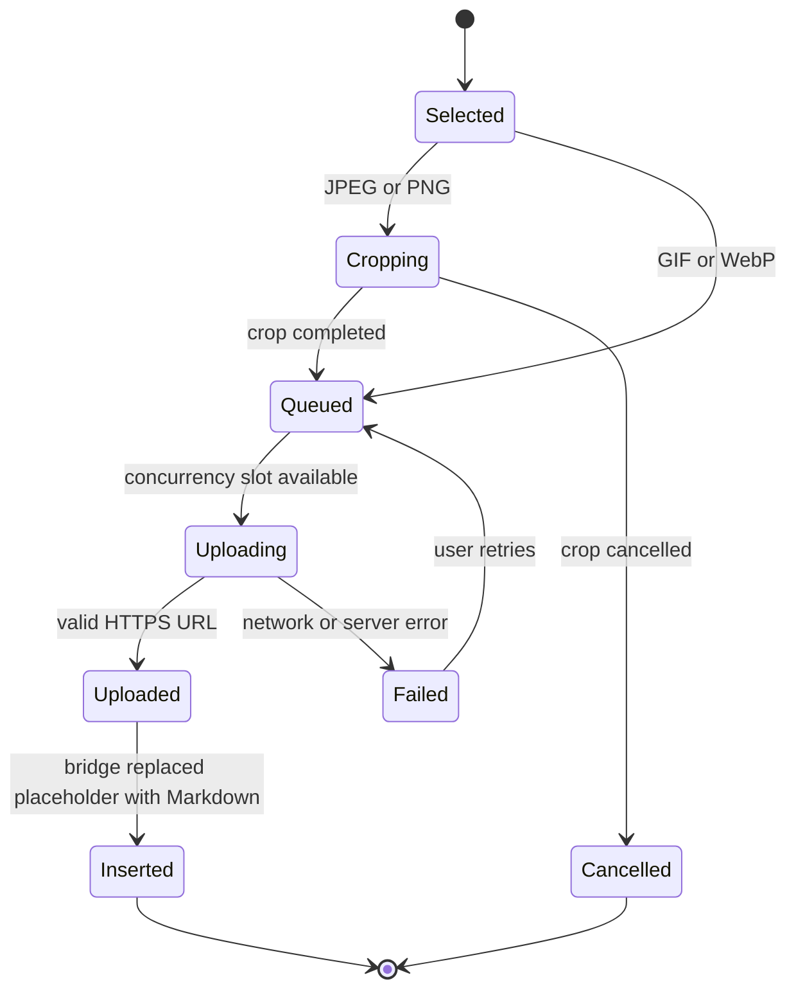

# 2Libra Android 客户端开发文档

本文定义基于 Android WebView 构建 2Libra 客户端的架构、功能接管协议、安全边界、实施顺序与验收标准。论坛移动 H5 继续承担内容展示和业务交互，Android 负责应用外壳、导航、页面分层、图片选择与图床上传、图片预览和 GSYVideoPlayer 视频能力。

> 状态：首版客户端代码已实现；服务端/H5 联调与真机验收待完成
> 更新日期：2026-08-31
> 适用工程：`com.suixin.sx2libra`

## 开始前必须确认的约束

- 论坛网站 `https://2libra.com/` 是账号、帖子、评论和上传业务的唯一数据源。
- 当前论坛已经适配移动端，客户端不重新实现首页帖子列表和帖子正文。
- 客户端整体采用 MVVM：Activity/Fragment 只渲染状态和转发用户意图，ViewModel 维护屏幕状态，Repository 统一访问 MMKV、网络和平台数据源。
- ViewModel 不持有 Activity、Fragment、View、WebView、Context、文件回调或 JavaScript ReplyProxy；这些生命周期对象留在 View/平台适配层。
- 首页底部导航固定为“帖子、消息、我的”三个 Tab，只响应点击切换；底部 Tab 不使用 ViewPager，也不能通过横向手势切换。
- “消息”和“我的”不在原生底部导航层做登录判断；点击后直接打开对应 H5 页面，由服务端响应决定是否需要登录。
- 所有 H5 业务 URL 跳转必须由新的 Activity 加载；当前页面的 WebView 只加载所属 Activity 的初始 URL，禁止通过 `loadUrl()`、`reload()`、`goBack()` 或 History API 复用当前 WebView 完成另一页面导航。
- “帖子”页内部使用可左右滑动的 TabLayout + ViewPager2，默认提供 2Libra 首页、今日热议、近期热议和新发表四个菜单。
- 帖子菜单允许新增、删除和拖动排序，配置通过 MMKV 持久化；完整 URL 始终由固定前缀 `https://2libra.com/` 与受校验的相对路径构造。
- “媒体本地渲染”默认指：媒体在正文中仍由 WebView 展示，点击后进入原生图片预览或视频播放器。
- 图片继续使用 PhotoView 原生预览；视频统一由 GSYVideoPlayer 播放，不再单独直接集成 Media3 播放器。
- 工程 `minSdk` 固定为 26。当前本地播放使用已发布且可解析的 GSYVideoPlayer Java 13.1.0；投屏保留可注入 SPI，但官方投屏能力仍未形成可验证的发布 artifact。
- 发帖选图由 Android 的 PictureSelector 接管，JPEG/PNG 使用 uCrop 裁切后再由 CompressHelper 压缩；GIF/WebP 保持原格式。Android 使用设置中选定的 Tikolu 或 Photo Lily 上传并取得 HTTPS 直链，再由 H5 按正式协议写入编辑器。
- 首版只调用 Tikolu 和 Photo Lily 的固定 HTTPS 上传接口，不内置第三方密钥、令牌或网页 token，也不把任意 provider URL 交给 H5。
- 原生能力优先使用 WebView 标准回调；只有标准回调无法表达的行为才使用受限 WebMessage Bridge。
- 不把论坛 Cookie、长期认证 Token、CSRF 信息或上传凭据复制到 SharedPreferences、数据库或 JS Bridge。图床选择单独保存在 `image_host` MMKV 配置中，上传请求不依赖 H5 票据。
- 本文不包含推送通知、离线发帖、后台上传和帖子正文完全原生化。

## 快速了解目标体验

客户端启动后显示带原生三项底部 TabBar 的移动论坛首页，默认选中“帖子”。底部三个 Tab 只能点击切换；点击“消息”或“我的”时直接加载对应 H5 页面，是否需要登录由服务端响应决定。“帖子”页内部显示可左右滑动的 TabLayout + ViewPager2，默认包含四个论坛列表，并可通过右侧设置按钮自定义。任一 H5 链接跳转都打开新的 Activity，系统返回关闭当前 Activity 并回到上一页面，不在原 WebView 中重新加载 URL。帖子图片进入 PhotoView 查看器，直接视频进入 GSYVideoPlayer 播放器，可拖动进度、查看进度缩略图、播放/暂停、切换倍速和画幅，并可投屏到 DLNA/UPnP 设备；发帖页点击图片按钮时进入 PictureSelector，静态图片经 uCrop 裁切、CompressHelper 压缩后上传到受控图床，取得 HTTPS 直链后按选择顺序插入 Markdown 编辑器。

固定的根 Tab 如下：

| Tab | 根入口 | 行为 |
| --- | --- | --- |
| 帖子 | 本地 `PostsFragment` | 展示可配置的论坛菜单 ViewPager2，作为默认 Tab |
| 消息 | `/notifications` | 直接加载通知和站内消息页面；登录要求由服务端处理 |
| 我的 | `/user/setting/profile` | 直接加载账号与个人设置页面；登录要求由服务端处理 |

发帖入口保留在页面顶部，不额外占用一个 Tab。客户端应隐藏网站自己的移动快捷导航，避免出现双层底部导航。

“帖子”页的默认二级菜单如下：

| 显示名称 | 保存路径 | 加载地址 |
| --- | --- | --- |
| 2Libra首页 | `/` | `https://2libra.com/` |
| 今日热议 | `/post/hot/today` | `https://2libra.com/post/hot/today` |
| 近期热议 | `/post/hot/recent` | `https://2libra.com/post/hot/recent` |
| 新发表 | `/post/latest` | `https://2libra.com/post/latest` |

## 当前工程基线

当前工程是最小 Android View 项目：

| 项目 | 当前值 |
| --- | --- |
| Application ID | `com.suixin.sx2libra` |
| `minSdk` | 26 |
| `targetSdk` / `compileSdk` | 34 / 34 |
| UI 技术 | XML + AndroidX Activity/Fragment + ViewPager2 |
| Java/Kotlin 字节码目标 | Java 8 |
| 业务依赖 | MMKV、AndroidX WebKit、PictureSelector/uCrop、CompressHelper、Glide、PhotoView、GSYVideoPlayer Java |
| 网络权限 | 已声明；明文流量已禁用 |
| App 入口 | `LibraApplication` + `MainActivity` |

基线文件：

- [`app/build.gradle`](../app/build.gradle)
- [`MainActivity.kt`](../app/src/main/java/com/suixin/sx2libra/MainActivity.kt)
- [`AndroidManifest.xml`](../app/src/main/AndroidManifest.xml)
- [`activity_main.xml`](../app/src/main/res/layout/activity_main.xml)

## 设计依据

以下事实来自当前工程和论坛页面的只读检查；未提交帖子、未选择文件、未上传媒体。

| 验证依据 | 设计结论 | 实现路径 |
| --- | --- | --- |
| 当前工程只有单 `Activity` 和空业务依赖 | 可从最小原生壳开始，不需要兼容既有架构 | 保持单模块，按 Activity + `web`/`media` 包拆分 |
| 论坛在 `433 × 937` 视口命中移动布局 | 不需要客户端重排帖子列表和正文 | WebView 直接使用现有移动 H5 |
| 移动首页已有网站快捷导航 | 原生 TabBar 会形成重复导航 | 使用论坛 `app-shell` 模式隐藏；注入脚本作为降级 |
| 论坛消息中心当前稳定地址为 `/notifications` | “消息”可作为独立根 Tab | `RoutePolicy` 将其标记为消息根页面 |
| 论坛登录页当前地址为 `/auth/login` | 消息和个人中心直接加载，登录要求交给服务端 | 页面级登录重定向兜底，必要时打开 `/auth/login` |
| 论坛页面当前提供 `/post/hot/today`、`/post/hot/recent` 和 `/post/latest` | 四个默认帖子菜单可使用稳定站内路径 | 首次启动写入默认 `ForumMenu` 列表 |
| 产品指定帖子页可自定义菜单且需持久化 | 菜单配置不能只保存在 Fragment 状态 | 使用 MMKV 保存有序 JSON 和配置版本号 |
| 产品指定整体采用 MVVM | 页面逻辑不能继续堆在 Activity/Fragment 中 | View → ViewModel → Repository → DataSource 单向数据流 |
| 产品指定业务页面跳转均使用新 Activity | 当前 WebView 不能承担后续 URL 历史 | 主 frame 导航统一转换为 `OpenPageAction`，新 Activity 只加载自己的初始 URL |
| 页面资源包含 Next.js `/_next/` chunks | 单靠 WebView URL 回调可能漏掉 SPA 路由 | document-start 点击捕获 + URL 回调兜底 |
| 帖子链接使用 `/post/{nodeSlug}/{postId}` | 帖子详情可稳定分类 | `RoutePolicy` 解析 scheme、host 和 path segments |
| 页面图片可能来自论坛媒体域、代理或帖子中的第三方图床 | 点击图片时统一交给原生预览，不依赖图床格式 | HTTPS URL 校验 + DOM `img` 捕获 |
| 发帖页有两个标准隐藏图片文件控件 | 可保留网站原上传流程作为兼容降级 | `onShowFileChooser()` 仍支持单图 `content://` 回传 |
| 文件控件没有 `multiple` | 标准文件回调当前只能单图；它不是首选图片入口 | `pick_and_upload_images` 直接启动原生单图选择 |
| 产品指定 PictureSelector + uCrop | 选择器和裁切属于同一原生流程 | PictureSelector → uCrop/原图 → `WebPageViewModel` → `ImageUploadRepository` |
| 用户提供的 Universal Image Uploader 代码为 2Libra 配置 Markdown、逐图占位符、批量队列和 3 路并发 | 可复用交互与队列模型 | 先回填占位符，并发上传，按占位符原顺序替换为图片直链 |
| 该插件默认依赖第三方网页 token、硬编码 Client ID/Token、可选公共代理及 `postMessage('*')` | 不能原样移植进生产 APK | 使用同源 Bridge、固定 provider 工厂和 HTTPS host allowlist |
| 图床 provider 有不同响应格式 | 客户端不能把任意响应或 URL 直接写入编辑器 | 固定 provider 工厂分别解析 Tikolu/Photo Lily，并只接受对应 HTTPS host |
| 参考工程 `ShowImgActivity` 使用黑底预览、PhotoView 手势、单击退出和长按保存 | 图片查看器需要复用这套核心交互 | `MediaPreviewActivity` 使用 PhotoView + 底部操作面板 |
| 参考工程保存时把资源解码为 Bitmap 并统一转成 JPEG | 直接复制会使 GIF/WebP 丢失动画或格式 | 保存时流式写入原始响应，不经过 Bitmap 二次编码 |
| 产品指定 GSYVideoPlayer 操作和预览视频 | 本地视频能力不再使用独立 Media3 接入 | `VideoPlayerActivity` 承载自定义 `LibraGSYVideoPlayer` |
| 官方已发布的 GSYVideoPlayer 13.1.0 Java artifact 可满足本地播放；公开 README 将 Cast 标为未发布能力，且尝试完整/Exo2 artifact 时传递依赖无法解析 | 不能把未发布的 `gsyvideoplayer-cast` 写成已交付功能 | 首版接入本地播放器与 Cast SPI；未安装 provider 时明确提示不可用，待上游提供可验证 artifact 后再接入 |
| GSYVideoPlayer 的进度缩略图使用 WebVTT 缩略图轨，不在手机端批量抽帧 | 仅有视频 URL 无法完整实现缩略图预览 | 论坛为视频生成 VTT 与缩略图，并通过 `play_video` payload 下发地址 |

## 客户端架构

首版在单 `app` 模块内采用轻量 MVVM，不额外叠加 UseCase/domain 层。Activity、Fragment、XML、WebView 和播放器属于 View；每个屏幕级页面拥有 ViewModel，通过单一 `StateFlow<UiState>` 驱动界面；Repository 是数据访问唯一入口，下接 MMKV、论坛网络、CookieManager、MediaStore 等 DataSource。依赖由 `LibraApplication` 中的手工 `AppContainer` 创建，再通过 `LibraViewModelFactory` 构造 ViewModel，首版不引入 Hilt。

底部三个根 Tab 由 `MainActivity` 的 Fragment 容器承载，不使用根级 ViewPager。“帖子”根页面单独使用可滑动的 TabLayout + ViewPager2；每个菜单对应惰性创建的 `ForumMenuPageFragment` 和受控 WebView。ViewPager2 保持当前页与相邻页，离屏 WebView 在 `onDestroyView()` 中销毁。



### 组件职责

| 组件 | 职责 | 不负责 |
| --- | --- | --- |
| `LibraApplication` / `AppContainer` | 创建单例 DataSource、Repository 和 ViewModel Factory | 保存页面 View 或执行业务动作 |
| `MainActivity` | 收集 `MainUiState`、渲染底部三 Tab、执行根 Fragment 切换和登录页 Action | 直接读取 Cookie、读写 MMKV 或处理论坛数据 |
| `MainViewModel` | 维护当前底部 Tab 和返回决策状态 | 持有 Activity、FragmentManager、CookieManager 或 WebView |
| `LoginActivity` / `LoginViewModel` | 使用共享 Cookie Profile 渲染登录页，登录成功后返回结果 | 保存账号密码或持有 WebView 引用 |
| `WebPageActivity` / `WebPageViewModel` | 以受校验的初始 URL 创建通用站内页面，接管后续页面跳转 | 在当前 WebView 中重新 `loadUrl()`、`reload()` 或 `goBack()` |
| `PostsFragment` | 收集 `PostsUiState`，渲染 TabLayout、ViewPager2 和设置按钮 | 直接读取 MMKV 或拼装菜单 URL |
| `PostsViewModel` | 订阅菜单 Repository、维护选中菜单并产生稳定 `PostsUiState` | 创建 Adapter、Tab 或 WebView |
| `SinglePageWebFragment` | 承载“消息”和“我的”WebView并渲染 `WebPageUiState` | 在回调中直接访问 Repository |
| `WebPageViewModel` | 维护 URL、加载、错误和图片上传任务状态 | 持有 WebView、ValueCallback 或 ReplyProxy |
| `ForumMenuPagerAdapter` | 用稳定菜单 ID 管理 `ForumMenuPageFragment` | 修改菜单配置 |
| `ForumMenuPageFragment` | 根据 `WebPageUiState` 创建、恢复和销毁 WebView | 接受任意外站 URL 或持有业务状态 |
| `MenuSettingsActivity` | 渲染设置状态、显示图床单选/删除确认框、连接 ItemTouchHelper | 直接修改帖子页 Adapter 或 MMKV |
| `MenuSettingsViewModel` | 校验新增/删除/排序意图、维护初始快照和图床选择状态 | 持有 RecyclerView、Dialog 或 Activity Result Launcher |
| `ForumMenuRepository` | 菜单单一事实来源，输出 Flow 并协调本地配置版本 | 暴露 MMKV API 给 ViewModel |
| `ForumMenuLocalDataSource` | 使用 MMKV 读写、校验和恢复版本化菜单 JSON | 决定 UI 选中位置 |
| `PostActivity` / `PostViewModel` | 渲染独立帖子 WebView并维护详情页状态 | 创建额外 TabBar 或持有 WebView 引用 |
| `WebSessionRepository` / `WebCookieDataSource` | 解析服务端确认的登录 Cookie，输出 `AuthState`，封装刷新、退出清理和会话边界 | 向上层暴露 Cookie 字符串，或把 Cookie 值保存到 MMKV/UiState |
| `LibraWebViewFactory` | 统一安全配置、Cookie、UA、调试开关 | 页面动作决策 |
| `LibraWebViewClient` | URL 分流、SSL 失败处理、页面生命周期 | 文件选择 |
| `LibraWebChromeClient` | 兼容 H5 标准文件选择、全屏视频、网页对话框 | 图床上传和路由分类 |
| `RoutePolicy` | 将 URL 分类为根页面、帖子、站内页面、外站 | 启动 Activity |
| `PageNavigator` | 根据已确认的 `OpenPageAction` 创建新的 `WebPageActivity`、`PostActivity` 或 `LoginActivity` | 复用来源页面 WebView 或绕过 URL 校验 |
| `NativeActionRouter` | 把受校验 Bridge 回调转换为 ViewModel 意图并回写已渲染结果 | 暴露任意 Android API 或承载长期状态 |
| `PostImagePicker` | 启动 PictureSelector、配置 uCrop、校验选择结果 | 网络上传 |
| `ImageUploadRepository` | 创建逐图任务、限制并发、调用上传 DataSource并输出进度状态 | 保存图床密钥或操作编辑器 DOM |
| `ImageUploadRemoteDataSource` | 按批次 provider 发送 multipart 并解析固定 HTTPS 直链 | 保存凭据、访问任意 host 或抓取第三方图床网页 |
| `MediaPreviewActivity` / `MediaPreviewViewModel` | 渲染黑底图片预览并维护分页、保存状态 | 在 ViewModel 中解码 Bitmap 或持有 PhotoView |
| `MediaRepository` / `MediaStoreDataSource` | 校验并流式保存原图，保持真实格式 | 把图片统一转码为 JPEG |
| `VideoPlayerActivity` / `VideoPlayerViewModel` | 渲染播放器并维护播放、倍速、画幅和投屏状态 | 在 ViewModel 中持有 GSY Player 或 Activity |
| `LibraGSYVideoPlayer` | GSY 控制层、进度缩略图、倍速、画幅和投屏入口 | 生成服务端缩略图 |
| `VideoCastController` | DLNA/UPnP 发现、连接、远端控制、进度同步和退投恢复 | 向接收设备发送论坛 Cookie |

### MVVM 数据流规则

所有页面遵守单向数据流：View 将点击、滑动、返回、文件选择结果等转换成 ViewModel 方法调用；ViewModel 调用 Repository 并更新不可变 `UiState`；View 在 `STARTED` 生命周期内收集状态并渲染。Repository 是唯一可以访问 DataSource 的层，ViewModel 不直接调用 MMKV、HTTP、CookieManager 或 MediaStore。

```kotlin
data class PostsUiState(
    val menus: List<ForumMenu> = emptyList(),
    val selectedMenuId: String? = null,
    val isLoading: Boolean = true,
    val error: PostsError? = null
)

class PostsViewModel(
    private val menuRepository: ForumMenuRepository,
    private val savedStateHandle: SavedStateHandle
) : ViewModel() {
    val uiState: StateFlow<PostsUiState> = menuRepository.observeMenus()
        .map { config -> config.toUiState(savedStateHandle["selectedMenuId"]) }
        .stateIn(
            scope = viewModelScope,
            started = SharingStarted.WhileSubscribed(5_000),
            initialValue = PostsUiState()
        )

    fun selectMenu(id: String) {
        savedStateHandle["selectedMenuId"] = id
    }
}
```

XML View 层使用 `repeatOnLifecycle()` 收集，不能在 `onCreate()` 中启动永久 collect：

```kotlin
viewLifecycleOwner.lifecycleScope.launch {
    viewLifecycleOwner.repeatOnLifecycle(Lifecycle.State.STARTED) {
        viewModel.uiState.collect(::render)
    }
}
```

需要显示确认框、打开 Activity 或向 WebMessage ReplyProxy 回写结果时，将待处理动作作为带唯一 ID 的可恢复 UiState；View 执行后调用 `onActionHandled(id)`。禁止使用会在旋转后重复消费的裸布尔值，也不让 ViewModel 直接调用 Dialog、Intent 或 JavaScript API。

WebView、GSYVideoPlayer、PictureSelector、Activity Result Launcher 和 ReplyProxy 都是 View/平台对象。回调进入 ViewModel 前必须转换为不含 Android View 引用的值对象，例如 `SelectedImage(uriString, mimeType, bytes)`、`WebRoute(url)` 或 `UploadResult(clientId, url)`；需要 `Context` 的文件、Cookie、MediaStore 和网络实现放在 DataSource 中，并只使用 Application Context。

## 组织代码

建议保持单 `app` 模块，按职责拆分包，首版不引入多模块和 Compose：

```text
app/src/main/
├── java/com/suixin/sx2libra/
│   ├── LibraApplication.kt
│   ├── core/
│   │   ├── AppContainer.kt
│   │   └── LibraViewModelFactory.kt
│   ├── model/
│   │   ├── AuthModels.kt
│   │   ├── ForumMenu.kt
│   │   ├── ImageUploadModels.kt
│   │   └── MediaModels.kt
│   ├── data/
│   │   ├── local/
│   │   │   ├── ForumMenuLocalDataSource.kt
│   │   │   └── MediaStoreDataSource.kt
│   │   ├── platform/
│   │   │   └── WebCookieDataSource.kt
│   │   ├── remote/
│   │   │   └── ImageUploadRemoteDataSource.kt
│   │   └── repository/
│   │       ├── ForumMenuRepository.kt
│   │       ├── ImageUploadRepository.kt
│   │       ├── MediaRepository.kt
│   │       └── WebSessionRepository.kt
│   ├── ui/
│   │   ├── main/
│   │   │   ├── MainActivity.kt
│   │   │   ├── MainViewModel.kt
│   │   │   └── MainUiState.kt
│   │   ├── auth/
│   │   │   ├── LoginActivity.kt
│   │   │   ├── LoginViewModel.kt
│   │   │   └── LoginUiState.kt
│   │   ├── posts/
│   │   │   ├── PostsFragment.kt
│   │   │   ├── PostsViewModel.kt
│   │   │   ├── PostsUiState.kt
│   │   │   ├── ForumMenuPageFragment.kt
│   │   │   └── ForumMenuPagerAdapter.kt
│   │   ├── menu/
│   │   │   ├── MenuSettingsActivity.kt
│   │   │   ├── MenuSettingsViewModel.kt
│   │   │   ├── MenuSettingsUiState.kt
│   │   │   └── MenuSettingsAdapter.kt
│   │   ├── post/
│   │   │   ├── PostActivity.kt
│   │   │   └── PostViewModel.kt
│   │   ├── web/
│   │   │   ├── WebPageActivity.kt
│   │   │   ├── SinglePageWebFragment.kt
│   │   │   └── WebPageViewModel.kt
│   │   └── media/
│   │       ├── MediaPreviewActivity.kt
│   │       ├── MediaPreviewViewModel.kt
│   │       ├── MediaPreviewAdapter.kt
│   │       ├── VideoPlayerActivity.kt
│   │       └── VideoPlayerViewModel.kt
│   └── web/
│       ├── BridgeMessage.kt
│       ├── LibraWebChromeClient.kt
│       ├── LibraWebViewClient.kt
│       ├── LibraWebViewFactory.kt
│       ├── NativeActionRouter.kt
│       ├── PageNavigator.kt
│       ├── RoutePolicy.kt
│       ├── PostImagePicker.kt
│       ├── PictureSelectorImageEngine.kt
│       ├── LibraCropEngine.kt
│       ├── LibraGSYVideoPlayer.kt
│       └── VideoCastController.kt
├── assets/web/
│   └── libra-bridge.js
└── res/
    ├── layout/
    │   ├── activity_main.xml
    │   ├── fragment_posts.xml
    │   ├── fragment_forum_menu_page.xml
    │   ├── activity_menu_settings.xml
    │   ├── item_forum_menu.xml
    │   ├── dialog_add_forum_menu.xml
    │   ├── activity_post.xml
    │   ├── activity_media_preview.xml
    │   ├── activity_video_player.xml
    │   └── view_libra_gsy_video_player.xml
    └── xml/
        └── file_paths.xml
```

依赖应通过现有 Version Catalog 管理。PictureSelector 与其 uCrop 模块必须锁定为同一版本；本文按官方仓库当前展示的 `v3.11.2` 记录，实施前再做一次版本兼容性检查：

```kotlin
dependencies {
    implementation("com.tencent:mmkv:2.4.2")

    implementation("io.github.lucksiege:pictureselector:v3.11.2")
    implementation("io.github.lucksiege:ucrop:v3.11.2")

    // 当前可解析的本地播放器；使用 SystemPlayerManager，不另行声明 Media3
    implementation("io.github.carguo:gsyvideoplayer-java:13.1.0")
}
```

截至本次实现，仓库可稳定解析的是 `gsyvideoplayer-java:13.1.0`。完整/Exo2 形态会引入当前仓库无法解析的 `LibRtmp-Client-for-Android:v3.2.0.m2`；公开 README 中 Cast 仍标记为未发布能力，因此工程不声明虚构的 `gsyvideoplayer-cast` 坐标。客户端已定义 `VideoCastController` SPI 和不可用降级提示；未来接入经验证的 DLNA/Google Cast provider 时，应保持远端会话、短时播放 URL 和退出恢复约束。

其余依赖选择与 `compileSdk 34` 兼容的稳定版本：

- AndroidX AppCompat、Activity 和 WebKit
- AndroidX Lifecycle ViewModel、SavedState 和 `lifecycle-runtime-ktx`，以及 Kotlin Coroutines Android
- Material Components 的 `BottomNavigationView` 和 `TabLayout`
- AndroidX Fragment、ViewPager2、RecyclerView 与 `ItemTouchHelper`
- 支持 multipart、上传进度、取消和 TLS 的 HTTP 客户端；只允许访问固定 Tikolu/Photo Lily endpoint，不引入第三方图床 SDK
- 支持 GIF 和磁盘缓存的图片加载库，并分别适配 PictureSelector `ImageEngine` 与 uCrop `UCropImageEngine`
- PhotoView `com.github.chrisbanes:PhotoView:2.3.0`，用于图片双击/双指缩放、拖动与点击事件

首版使用 `AppContainer` + `ViewModelProvider.Factory` 手工注入，不同时引入 Hilt/Koin。若项目后续扩展到多模块或大量构造依赖，再单独评估迁移 Hilt；迁移不得改变 ViewModel 只依赖 Repository 接口的边界。

PhotoView 通过 JitPack 获取。当前工程使用 `FAIL_ON_PROJECT_REPOS`，因此只在 `settings.gradle` 的 `dependencyResolutionManagement.repositories` 增加受限仓库：

```groovy
maven {
    url = uri("https://jitpack.io")
    content {
        includeGroup("com.github.chrisbanes")
    }
}
```

发布构建应按 PictureSelector 官方说明保留选择器与 uCrop 类型：

```proguard
-keep class com.luck.picture.lib.** { *; }
-dontwarn com.yalantis.ucrop**
-keep class com.yalantis.ucrop** { *; }
-keep interface com.yalantis.ucrop** { *; }
```

## 配置 WebView

所有 WebView 必须由同一个工厂创建，防止首页和帖子页配置漂移。

每个 WebView 都绑定创建它的页面实例和一个经过校验的 `initialUrl`。首次创建时只能调用一次 `loadUrl(initialUrl)`；旋转优先使用 `saveState()`/`restoreState()`，进程重建无法恢复时可以重新初始化同一个 `initialUrl`，但不能借此切换到另一个业务 URL。业务代码中禁止对现有 WebView 调用 `loadUrl(newUrl)`、`reload()`、`goBack()` 或 `goForward()`。网页表单 POST、页面内部资源请求以及服务端为完成当前请求产生的允许列表内 HTTP 重定向由 WebView 正常处理，它们不属于客户端主动重载；一旦形成新的业务落地路由，仍交给统一 Activity 导航策略。

必须启用：

- JavaScript：论坛是 Next.js 应用，关闭后无法正常工作。
- DOM Storage：保证论坛本地状态正常持久化。
- Cookie：共享首页、详情页和发帖页登录状态。

必须限制：

- 仅允许 HTTPS 顶层页面进入 WebView。
- 顶层站内页面只允许 `2libra.com`。
- 图片点击统一接受可由原生重新请求的 HTTPS URL；视频和 VTT 仍只允许 `r2.2libra.com` 媒体路径。
- 禁止 `file://` 顶层页面和文件系统访问。
- 保留受控的 `content://` 读取能力，用于文件选择回调返回的图片。
- 禁止混合内容、自动弹窗和任意新窗口。
- SSL 校验失败时直接取消，不能调用 `proceed()`。
- 仅在 `BuildConfig.DEBUG` 下开启 WebView 远程调试。

推荐配置原则：

```kotlin
webView.settings.apply {
    javaScriptEnabled = true
    domStorageEnabled = true
    allowFileAccess = false
    allowContentAccess = true
    mixedContentMode = WebSettings.MIXED_CONTENT_NEVER_ALLOW
    javaScriptCanOpenWindowsAutomatically = false
    setSupportMultipleWindows(false)
}
```

`allowContentAccess = true` 只用于读取 PictureSelector 结果或 uCrop 输出对应的 `content://` URI。`RoutePolicy` 仍必须拒绝把 `content://`、`file://` 和 `javascript:` 作为顶层页面加载。

客户端 UA 应保留系统原 UA 并追加标识，例如：

```text
<system-user-agent> 2LibraAndroid/1.0
```

若可以修改论坛前端，网站应通过该标识进入 `app-shell` 模式，隐藏移动快捷导航并启用显式 Bridge 协议。若不能修改网站，客户端可在 document-start 阶段注入最小化的样式和事件监听；所有选择器集中放在 `assets/web/libra-bridge.js`，并纳入回归测试。

## 保持登录状态

> 实施前置条件：论坛服务端必须确认用于表示已登录会话的精确 Cookie 名称及作用域。客户端不得通过任意 Cookie、用户名 Cookie 或 `CookieManager.hasCookies()` 推断登录，因为统计、主题和 CSRF Cookie 在未登录时也可能存在。当前登录页使用已验证地址 `https://2libra.com/auth/login`。

使用 WebView 默认 Profile 的 `CookieManager`，不要自行序列化 Cookie：

```kotlin
val cookieManager = CookieManager.getInstance().apply {
    setAcceptCookie(true)
}

webView.settings.domStorageEnabled = true
```

首页和 `PostActivity` 在同一应用进程、同一默认 Profile 下自动共享 Cookie。登录成功或应用进入后台时可以调用：

```kotlin
CookieManager.getInstance().flush()
```

MVVM 中由 `WebCookieDataSource` 封装上述 `CookieManager` 调用，精确解析服务端确认的会话 Cookie 名称，只向 `WebSessionRepository` 返回 `AuthState`，不返回原始 Cookie。Repository 对 ViewModel 暴露 `observeAuthState()`、`refreshAuthState()`、`flushSession()` 和 `logout()`；Activity、Fragment、ViewModel 都不直接操作 Cookie Store。Cookie 不进入 `UiState`、`SavedStateHandle`、MMKV、日志或崩溃上报。实际 WebView Profile 和 Cookie 注入仍由 `LibraWebViewFactory` 在 View/平台适配层统一配置。

### 通过 Cookie 刷新登录态

`CookieManager` 提供 `getCookie()`、`flush()` 和删除能力，但没有 Cookie 变更监听回调。因此这里的“监听”采用事件驱动刷新，不启动定时轮询：

1. App 冷启动及从后台回到前台时刷新一次。
2. 2Libra 主 frame 完成页面加载、登录成功跳转或退出完成时刷新一次。
3. 任一页面导航到 `/auth/login` 时立即更新为未登录。

统一状态定义如下：

```kotlin
enum class AuthState {
    UNKNOWN,
    LOGGED_OUT,
    LOGGED_IN
}
```

`WebCookieDataSource` 对 `CookieManager.getCookie("https://2libra.com/")` 返回的 Cookie header 按分号拆分，再按第一个 `=` 分隔名称和值；名称必须与服务端配置精确相等，不能使用 `contains()`。目标 Cookie 缺失或值为空时返回 `LOGGED_OUT`，存在时返回本地候选状态 `LOGGED_IN`。DataSource 不解析、缓存或向上层暴露 Cookie 值。

Cookie 存在不代表服务端会话一定仍有效。若服务端判定会话过期并把 `/notifications`、`/user/setting/profile` 等受保护页面重定向到 `/auth/login`，`LibraWebViewClient` 必须把该主 frame 路由转换成 `SessionExpired` 意图；`WebSessionRepository` 更新为 `LOGGED_OUT`，并进入与主动点击未登录 Tab 相同的登录流程。若以后要求在显示受保护页面前严格确认服务端会话有效性，应增加同源会话检查接口；不能只凭 Cookie 值做强认证判断。

### 消息和我的 Tab

“消息”和“我的”不做原生登录门禁：

1. 用户点击底部 Tab 后，`MainActivity` 调用 `MainViewModel.onRootTabSelected(target)` 并立即切换选中项。
2. 对应的 `SinglePageWebFragment` 直接加载 `/notifications` 或 `/user/setting/profile`。
3. 如果服务端将页面重定向到 `/auth/login`，由现有页面级 `WebPageViewModel` 处理登录页 Action；这不是 Tab 切换前的本地登录判断。

注意：

- `flush()` 可能执行 I/O，只在状态边界调用，不在每次页面加载时调用。
- 登录能保持多久由服务端 Cookie 的 `Expires`、`Max-Age` 和服务端会话有效期决定。
- 当前 `targetSdk 34` 默认拒绝第三方 Cookie；只有第三方登录经过验证确实需要时，才针对对应 WebView 单独开启。
- 用户主动退出时先走论坛退出流程，再清理 Cookie；Activity 销毁和 App 退出不清理 Cookie、WebStorage 或缓存。
- 用户退出后立即将 `AuthState` 更新为 `LOGGED_OUT`；如果当前位于消息/我的页面，切回“帖子”并销毁受保护 WebView 的页面历史。
- 不创建不同的 WebView Profile，也不为不同 Activity 设置不同数据目录后缀。

## 实现两级 Tab、菜单设置和返回行为

### 区分底部 Tab 和帖子菜单滑动

`MainActivity` 使用只包含“帖子、消息、我的”的 `BottomNavigationView`，通过 Fragment 容器点击切换三个根页面。根页面不放入 ViewPager，不注册左右滑动切换逻辑。三个 Tab 均直接切换，页面是否需要登录由服务端处理。

“帖子”对应 `PostsFragment`，内部使用 TabLayout + ViewPager2。这里允许左右滑动，且必须与 TabLayout 双向同步：点击二级 Tab 切换页面，滑动 ViewPager2 后更新选中 Tab。两层行为不能混用：帖子页内部滑动只改变论坛菜单，不得改变底部“帖子”选中状态。

```kotlin
viewPager.adapter = forumMenuPagerAdapter
viewPager.isUserInputEnabled = true
viewPager.offscreenPageLimit = 1

tabLayoutMediator = TabLayoutMediator(tabLayout, viewPager) { tab, position ->
    tab.text = forumMenuPagerAdapter.menuAt(position).name
}.also { it.attach() }
```

帖子页每个菜单由 `ForumMenuPageFragment` 加载一个受控 2Libra WebView。`FragmentStateAdapter` 使用菜单稳定 ID 实现 `getItemId()` 和 `containsItem()`，排序后复用未变化页面；当前菜单与相邻菜单按 ViewPager2 默认策略保留，远离当前页的 WebView 在 `onDestroyView()` 中保存必要状态并销毁。

### 布置 TabLayout 和设置按钮

TabLayout 使用 `MODE_SCROLLABLE`，占据标题行除设置按钮以外的宽度。设置按钮固定在右侧，不参与 Tab 横向滚动；按钮与 TabLayout 在同一 Y 轴居中，触摸区域至少 `48dp × 48dp`，并提供“管理帖子菜单”的无障碍描述。

```xml
<androidx.constraintlayout.widget.ConstraintLayout
    android:layout_width="match_parent"
    android:layout_height="match_parent">

    <com.google.android.material.tabs.TabLayout
        android:id="@+id/post_tabs"
        android:layout_width="0dp"
        android:layout_height="wrap_content"
        app:tabMode="scrollable"
        app:layout_constraintStart_toStartOf="parent"
        app:layout_constraintEnd_toStartOf="@id/menu_settings"
        app:layout_constraintTop_toTopOf="parent" />

    <androidx.appcompat.widget.AppCompatImageButton
        android:id="@+id/menu_settings"
        android:layout_width="48dp"
        android:layout_height="48dp"
        android:background="?attr/selectableItemBackgroundBorderless"
        android:contentDescription="管理帖子菜单"
        app:layout_constraintEnd_toEndOf="parent"
        app:layout_constraintTop_toTopOf="@id/post_tabs"
        app:layout_constraintBottom_toBottomOf="@id/post_tabs" />

    <androidx.viewpager2.widget.ViewPager2
        android:id="@+id/post_pager"
        android:layout_width="0dp"
        android:layout_height="0dp"
        app:layout_constraintStart_toStartOf="parent"
        app:layout_constraintEnd_toEndOf="parent"
        app:layout_constraintTop_toBottomOf="@id/post_tabs"
        app:layout_constraintBottom_toBottomOf="parent" />

</androidx.constraintlayout.widget.ConstraintLayout>
```

### 使用 MMKV 保存有序菜单

工程使用腾讯开源 MMKV `2.4.2`。`LibraApplication.onCreate()` 初始化 MMKV，并在 Manifest 中设置 `android:name=".LibraApplication"`：

```kotlin
class LibraApplication : Application() {
    lateinit var appContainer: AppContainer
        private set

    override fun onCreate() {
        super.onCreate()
        MMKV.initialize(this)
        appContainer = AppContainer(applicationContext)
    }
}
```

`ForumMenuLocalDataSource` 使用独立实例 `MMKV.mmkvWithID("forum_menu")`，将完整配置编码为单个 `forum_menu_config_v1` JSON 字符串。MMKV 写入立即生效，不再调用 SharedPreferences 的 `apply()`；列表和 revision 放在同一 JSON 中，确保读到的是同一版本。`ForumMenuRepository` 封装该 DataSource 并向 ViewModel 暴露 `Flow<ForumMenuConfig>`，Activity/Fragment/ViewModel 均不得取得 MMKV 实例。

```json
{
  "schemaVersion": 1,
  "revision": 6,
  "menus": [
    {"id": "default-home", "name": "2Libra首页", "path": "/"},
    {"id": "default-today", "name": "今日热议", "path": "/post/hot/today"},
    {"id": "default-recent", "name": "近期热议", "path": "/post/hot/recent"},
    {"id": "default-latest", "name": "新发表", "path": "/post/latest"}
  ]
}
```

首次启动键不存在时由 DataSource 写入以上四个默认菜单。每个新增菜单使用 UUID 作为稳定 ID；Repository 收到名称、路径或顺序变更后先校验，DataSource 再一次性覆盖完整列表并将 revision 加一。配置缺字段、JSON 损坏、路径非法或列表为空时恢复四个默认菜单，不使用部分损坏数据。

菜单配置不是账号数据，不写入 Cookie Store。名称和路径不包含隐私信息，因此首版使用普通 MMKV，不启用自定义加密密钥；若以后保存认证信息，必须另行设计安全存储，不能复用此配置实例。

### 新增菜单

设置页顶部提供新增按钮。新增界面包含名称输入框和路径输入框，路径输入框固定显示不可编辑前缀 `https://2libra.com/`，用户只输入后续路径，例如 `node/android`。保存时执行以下校验：

1. 名称去除首尾空格后必须为单行、1～20 个字符，用于 TabLayout 文本。
2. 路径允许留空表示首页；有值时统一规范成以 `/` 开头的相对路径。
3. 拒绝 scheme、host、`//`、反斜杠、控制字符、query、fragment 和 `.`/`..` 路径段，防止把固定前缀绕到外站。
4. 使用 `Uri.Builder().scheme("https").authority("2libra.com")` 构造最终地址，再次确认 scheme 和 host 精确匹配。
5. 规范化后的名称和路径不能与现有菜单重复。

View 调用 `MenuSettingsViewModel.addMenu(name, path)`；ViewModel 将意图交给 Repository。校验成功后 Repository 将菜单追加到末尾并持久化，再通过 UiState 驱动列表更新。界面只显示固定前缀和用户输入的相对部分，配置中仅保存规范化路径，不保存可被篡改的完整 URL。

### 删除菜单

默认菜单和自定义菜单均可删除，但至少保留一个。点击删除时调用 `MenuSettingsViewModel.requestDelete(id)`，UiState 暴露待确认菜单，View 使用 Material 弹窗显示名称；取消调用 `cancelDelete()`，确认调用 `confirmDelete()`，只有确认路径才由 Repository 删除并持久化。删除当前正在显示的菜单时，`PostsViewModel` 优先选择原位置的下一项；没有下一项时选择前一项。

### 拖动调整位置

设置页使用 RecyclerView 展示菜单列表，每行右侧固定一个拖动图标。只有按住该图标才能上下拖动，点击行内容或从其他位置长按不能启动排序：

```kotlin
val callback = object : ItemTouchHelper.SimpleCallback(
    ItemTouchHelper.UP or ItemTouchHelper.DOWN,
    0
) {
    override fun onMove(
        recyclerView: RecyclerView,
        source: RecyclerView.ViewHolder,
        target: RecyclerView.ViewHolder
    ): Boolean = adapter.move(source.bindingAdapterPosition, target.bindingAdapterPosition)

    override fun onSwiped(viewHolder: RecyclerView.ViewHolder, direction: Int) = Unit

    override fun isLongPressDragEnabled(): Boolean = false

    override fun clearView(recyclerView: RecyclerView, viewHolder: RecyclerView.ViewHolder) {
        super.clearView(recyclerView, viewHolder)
        viewModel.onReorderFinished(adapter.currentMenuIds())
    }
}

val itemTouchHelper = ItemTouchHelper(callback).also { it.attachToRecyclerView(menuList) }
adapter.onDragHandleDown = { holder -> itemTouchHelper.startDrag(holder) }
```

`onMove()` 只更新 Adapter 的临时展示顺序；拖动结束的 `clearView()` 把最终 ID 顺序交给 `MenuSettingsViewModel`。ViewModel 调用 Repository，只有顺序确实改变时才由 DataSource 写一次 MMKV 并增加 revision，避免每经过一行就写盘。

### 关闭设置页并刷新帖子菜单

`PostsFragment` 通过 Activity Result API 打开 `MenuSettingsActivity`。`MenuSettingsViewModel` 记录打开时的规范化菜单快照和 `startRevision`；新增、确认删除和拖动结束都通过 Repository 即时保存，关闭按钮、系统返回和返回手势统一读取 `MenuSettingsUiState.hasChanges`：

1. 重新读取并规范化当前菜单列表。
2. 当前列表与打开时快照不同时，返回 `RESULT_OK` 和新 revision。
3. 两份列表完全相同，包括用户操作后又恢复原状的情况，返回 `RESULT_CANCELED`，帖子页不重建 TabLayout 和 Adapter。

帖子页收到 `RESULT_OK` 后调用 `PostsViewModel.onMenuSettingsClosed(revision)`；ViewModel 让 Repository 刷新并输出新的 `PostsUiState`。Fragment 只根据状态更新 `ForumMenuPagerAdapter`、重新绑定 TabLayoutMediator，并优先恢复同一稳定 ID。该菜单已删除时由 ViewModel 在 UiState 中给出最近菜单。为覆盖进程回收或 Activity Result 丢失，`PostsFragment.onResume()` 调用 `viewModel.refreshMenus()`；Repository 比较 revision 和规范化内容，相同则不产生无效 UI 更新。

### 返回行为

1. `WebPageActivity`、`PostActivity` 和 `LoginActivity` 不调用 WebView `goBack()`；系统返回直接结束当前 Activity，恢复 Activity 栈中的上一页面。
2. 根 Tab 的 WebView 不保存业务页面历史，因为所有主 frame 业务跳转在提交前已被 Activity 导航接管。
3. 已到“消息”或“我的”根页面时，返回键先切回底部“帖子”。
4. 已在“帖子”根页面时再次返回退出 `MainActivity`；返回键不切换相邻帖子菜单。
5. 详情页内部点击另一个帖子时新建另一个 `PostActivity`；普通站内链接新建 `WebPageActivity`，不得复用当前详情 WebView。

## 使用新 Activity 接管页面跳转

论坛使用 Next.js 前端路由，链接虽然具有标准 `href`，点击后仍可能由前端在同一 document 内切换。所有主 frame 业务 URL 跳转统一接管：

1. document-start JS 在捕获阶段监听站内链接点击，先 `preventDefault()` 阻止 Next.js 在当前 document 内切换，再发送受限 WebMessage。
2. `shouldOverrideUrlLoading()` 处理普通 GET 导航、`target=_blank`、重定向和未被 JS 捕获的情况。对于需要新页面的主 frame URL，返回 `true` 取消当前 WebView 加载，并产生 `OpenPageAction`。
3. `PageNavigator` 根据路由创建新的 Activity，并把规范化后的 HTTPS URL 放入只读 Intent extra；目标 Activity 重新执行 scheme、host、path 和长度校验后，首次创建 WebView 并只调用一次 `loadUrl(initialUrl)`。
4. 网页 POST 不保证触发 `shouldOverrideUrlLoading()`；登录、评论、发帖等表单仍由当前 WebView 完成提交及其直接服务端重定向。重定向落到不同业务路由后，由 `onPageCommitVisible()`/document-start 路由通知打开新 Activity，并在新 Activity 成功创建后结束已提交表单的来源 Activity，防止返回时暴露已经变成新 URL 的旧 WebView；落回同一规范页面时只视为当前表单状态更新。任何路径都不得由客户端在来源 WebView 上补调 `loadUrl()`。

同一规范 URL 的快速重复点击只创建一个 Action，确认后才能再次触发；这用于防抖，不得通过 `singleTop`、`CLEAR_TOP` 或复用当前 Activity 改变“一个业务页面一个 Activity”的语义。

```kotlin
override fun shouldOverrideUrlLoading(
    view: WebView,
    request: WebResourceRequest
): Boolean {
    if (!request.isForMainFrame) return false

    val target = request.url
    if (request.isRedirect && routePolicy.isAllowedSamePageRedirect(initialUrl, target)) {
        return false
    }

    viewModel.onOpenPageRequested(target.toString())
    return true
}
```

返回 `true` 后只允许 ViewModel 产生 `OpenPageAction`，不能调用 `view.loadUrl(target)`。`isAllowedSamePageRedirect()` 只放行完成当前初始请求所需的同业务路由规范化重定向；跨业务路由、登录页和外站不属于该范围。

当前需要识别的地址类型：

| 地址 | 分类 | 行为 |
| --- | --- | --- |
| `/` | 默认帖子菜单 | 作为根菜单初始地址时由 `ForumMenuPageFragment` 加载；从 H5 点击时新建 `WebPageActivity` |
| `/post/hot/today` | 默认帖子菜单 | 作为二级 Tab 初始地址时由 `ForumMenuPageFragment` 加载；从 H5 点击时新建 `WebPageActivity` |
| `/post/hot/recent` | 默认帖子菜单 | 作为二级 Tab 初始地址时由 `ForumMenuPageFragment` 加载；从 H5 点击时新建 `WebPageActivity` |
| `/post/latest` | 默认帖子菜单 | 作为二级 Tab 初始地址时由 `ForumMenuPageFragment` 加载；从 H5 点击时新建 `WebPageActivity` |
| `/notifications` | “消息”根页面 | 作为根 Tab 初始地址时由消息 Fragment 加载；从 H5 点击时认证后新建 `WebPageActivity` |
| `/user/setting/profile` | “我的”根页面 | 作为根 Tab 初始地址时由我的 Fragment 加载；从 H5 点击时认证后新建 `WebPageActivity` |
| `/auth/login` | 登录页面 | 新建 `LoginActivity` |
| `/post/create` | 发帖页面 | 新建 `WebPageActivity`，启用发帖图片 Bridge |
| `/post/{nodeSlug}/{postId}` | 帖子详情 | 每次新建 `PostActivity` |
| `/node/...`、`/following` | 普通站内页面 | 新建 `WebPageActivity` |
| 其他 HTTPS host | 外站 | Custom Tab 或系统浏览器 |
| `http`、`file`、`content`、`javascript` 等顶层地址 | 非法页面 | 拒绝加载 |

`RoutePolicy` 必须解析 `Uri.scheme`、`Uri.host` 和 path segments，不能使用字符串 `startsWith("https://2libra.com")`，否则会错误接受伪造 host。

在 MVVM 中，`RoutePolicy` 是无 Android 界面依赖的纯分类器。`LibraWebViewClient` 和 Bridge 只把当前 URL、来源、是否主 frame、是否重定向与用户手势转换为 `WebRoute` 值对象并交给 `WebPageViewModel`；ViewModel 将待执行导航写入带唯一 ID 的 `WebPageUiState.pendingAction`。Fragment/Activity 收集状态后调用 `PageNavigator` 新建页面 Activity、外部浏览器或拒绝加载，并以 `onActionHandled(id)` 确认。`RoutePolicy`、WebViewClient 和 ViewModel 都不直接启动 Activity，也不对来源 WebView 调用任何导航方法。

## 原生渲染媒体

首版保留 WebView 内联媒体，用户点击帖子媒体后进入原生界面。

媒体页面同样遵循 MVVM：`MediaPreviewViewModel` 和 `VideoPlayerViewModel` 只维护 URL、当前索引、保存/播放状态、倍速、画幅与投屏状态；`MediaRepository` 负责媒体校验、下载和保存等 I/O。PhotoView、GSYVideoPlayer、Activity Result、Dialog、投屏 SDK 的界面与生命周期实例由 Activity/平台适配器持有。播放器回调先转换为 `PlaybackSnapshot` 等不可变值再传给 ViewModel，ViewModel 不保存 Player、Bitmap、Drawable 或 Activity 引用。

| 资源 | 识别规则 | 行为 |
| --- | --- | --- |
| 页面中的图片 | 任意可由原生重新请求的 HTTPS `` URL | `MediaPreviewActivity` |
| GIF 图片 | HTTPS 图片 URL + 动图 MIME | 支持动画的原生预览 |
| `data:`/`blob:` 临时图片 | WebView 内部临时资源 | 留在 WebView |
| 直接 MP4/WebM/HLS | `video.currentSrc` 或已知媒体 URL | `VideoPlayerActivity` + GSYVideoPlayer |
| 第三方 iframe | 外部嵌入页 | 留在 WebView 或外部 App |

图片点击消息只传递当前页面内去重后的 URL 列表，不通过 Bridge 传递图片二进制；列表过长时保留被点击图片及其邻近项。原生图片库和 GSYVideoPlayer 直接请求媒体地址；若资源未来需要认证，再由受控网络层追加必要的 Referer 或 Cookie，而不是把 Cookie 暴露给 JS。

### 实现图片查看器

交互参考 [`ShowImgActivity.java`](../../zizihongbeiwu-android/common/src/main/java/com/xmrbb/common/page/img/ShowImgActivity.java) 和 [`activity_show_img.xml`](../../zizihongbeiwu-android/common/src/main/res/layout/activity_show_img.xml)，在 `MediaPreviewActivity` 中重新实现，不直接复制旧代码。

打开参数只接受原生侧重新校验后的数据：

| 参数 | 类型 | 约束 |
| --- | --- | --- |
| `urls` | `ArrayList<String>` | 1～50 个 HTTPS 帖子媒体 URL，去重并保持正文顺序 |
| `initialIndex` | `Int` | 必须位于 `urls.indices`，否则拒绝打开 |

推荐布局为黑色 edge-to-edge 根容器、`ViewPager2`、每页一个 `com.github.chrisbanes.photoview.PhotoView`，顶部仅显示可选的 `当前位置/总数`。当前图片使用与 PictureSelector 共用的图片加载库加载，保留正常的内存和磁盘缓存；GIF 以动画 Drawable 展示。

交互规则与参考实现保持一致，并补全动态媒体场景：

- 双指和双击缩放，放大后可拖动查看；缩放到边界后才允许切换上一张或下一张。
- 单击图片或黑色空白处：底部操作面板已显示时先关闭面板，否则退出预览。
- 长按当前图片：打开底部操作面板，提供“保存图片”和“取消”。使用 `BottomSheetDialog` 或等价的可访问组件，不复制手写位移动画。
- 系统返回：先关闭操作面板；面板未显示时退出 Activity。
- 图片加载失败：显示失败占位和重试入口，不能停留在无反馈的黑屏。
- Activity 不强制竖屏；旋转和进程重建后恢复当前页，页面退出时取消仅属于该界面的未完成请求。

参考实现中的以下细节不复制：

| 参考行为 | 本项目处理 |
| --- | --- |
| XML 使用旧类名 `uk.co.senab.photoview.PhotoView` | 使用依赖对应的 `com.github.chrisbanes.photoview.PhotoView` |
| 在 `PhotoView` 外再次创建 `PhotoViewAttacher` | 直接使用现代 `PhotoView` 自带的缩放和监听 API |
| Glide 关闭内存、磁盘缓存 | 正常启用缓存，降低重复查看流量与等待时间 |
| Activity 固定竖屏 | 遵循设备方向并恢复当前索引 |
| 空 URI 时直接 `return` | 显示错误并立即结束 Activity |

### 保存当前图片

“保存图片”只保存当前页。不能直接复制参考 [`PhotoUtil.java`](../../zizihongbeiwu-android/common/src/main/java/com/xmrbb/common/utils/PhotoUtil.java) 的 `Glide.asBitmap()` → JPEG 方案，因为它会重编码图片并破坏 GIF、动画 WebP、透明通道和原始元数据。

保存流程如下：

1. 再次校验 URL 的 scheme、host 和媒体路径；HTTP 重定向后的最终地址也必须通过同一 allowlist。
2. 以流方式下载原始响应，限制最大响应体并校验真实 MIME，只允许 JPEG、PNG、WebP 和 GIF。
3. Android 10 及以上通过 `MediaStore.Images` 写入 `Pictures/2Libra`：先设置 `IS_PENDING=1`，完整写入后再设为 `0`；失败时删除未完成记录。
4. Android 9 及以下在用户授权 `WRITE_EXTERNAL_STORAGE` 后写入公共 Pictures 目录，并通知 MediaScanner。
5. 文件扩展名、`DISPLAY_NAME` 和 `MIME_TYPE` 必须一致；成功后提示保存位置，失败或取消时给出明确反馈。

保存请求与 Activity 生命周期解耦，但界面销毁后不得继续持有 Activity。若媒体需要论坛登录态，由受控原生网络层仅向 `2libra.com`/`r2.2libra.com` 附加必要 Cookie 或 Referer，不记录这些请求头，也不通过 Bridge 返回给网页。

### 使用 GSYVideoPlayer 播放与预览视频

`VideoPlayerActivity` 只接收原生侧重新校验后的结构化参数：

| 参数 | 必填 | 约束 |
| --- | --- | --- |
| `url` | 是 | HTTPS 视频或 HLS 地址，host 和最终重定向地址均命中媒体 allowlist |
| `title` | 否 | 来自当前帖子，限制长度，只用于播放器标题和投屏元数据 |
| `posterUrl` | 否 | HTTPS 论坛媒体地址，校验规则与图片预览一致 |
| `previewVttUrl` | 条件必填 | 要显示进度缩略图时必须提供；VTT 及其引用图片均为 HTTPS 受信媒体地址 |
| `mimeType` | 是 | 原生根据 URL、响应头和探测结果校验，不能只信任 H5 字段 |

H5 发出的 `play_video` payload 建议固定为：

```json
{
  "url": "https://r2.2libra.com/video/example.mp4",
  "title": "帖子中的视频",
  "posterUrl": "https://r2.2libra.com/i/example-cover.webp",
  "previewVttUrl": "https://r2.2libra.com/video/example-thumbs.vtt",
  "mimeType": "video/mp4"
}
```

`LibraGSYVideoPlayer` 继承 `StandardGSYVideoPlayer`，参考官方 `PreViewGSYVideoPlayer` 接入 WebVTT 预览，并使用自定义布局增加倍速、画幅和投屏按钮。首版能力定义如下：

| 能力 | 本地播放行为 | 实现要求 |
| --- | --- | --- |
| 拖动进度 | 底部 SeekBar 和全屏横向手势都可 seek | 开启 `setIsTouchWiget(true)` 与全屏触控；暂停状态也允许定位 |
| 进度小图预览 | 用户拖动 SeekBar 时，在滑块上方显示对应时间点缩略图 | `setOpenPreView(true)` + `setPreviewVttUrl(...)`，支持独立图片和雪碧图 `#xywh` 区域 |
| 播放/暂停 | 中央按钮和底部按钮使用同一播放状态 | 缓冲中禁止重复 start；错误、完成、暂停和播放图标必须一致 |
| 倍速 | 菜单提供 `0.5× / 0.75× / 1.0× / 1.25× / 1.5× / 2.0×`，默认 `1.0×` | 播放中调用 `setSpeedPlaying(speed, true)`，切换全屏后保持当前值 |
| 修改画幅 | 菜单提供“原始适配 / 16:9 / 4:3 / 裁剪铺满 / 拉伸铺满” | 映射到 `SCREEN_TYPE_DEFAULT`、`SCREEN_TYPE_16_9`、`SCREEN_TYPE_4_3`、`SCREEN_TYPE_FULL`、`SCREEN_MATCH_FULL` |
| 全屏 | 点击全屏进入横屏控制界面，返回键先退出全屏 | 正常与全屏播放器共享 URL、进度、倍速、画幅和预览轨状态 |
| 投屏 | 用户主动选择接收设备；当前未安装 provider 时明确提示不可用 | 通过 `VideoCastController` SPI 接入后支持发现、连接、播放/暂停、seek、停止和断开恢复 |

`GSYVideoType.setShowType()` 是进程级全局配置。`VideoPlayerActivity` 打开时保存旧画幅，切换后通知当前普通/全屏播放器刷新渲染尺寸，退出时恢复旧值；首版同时只允许一个原生视频会话，避免全局画幅污染其他播放器。

#### 进度缩略图的数据前提

进度小图不是从远程视频在手机端临时批量抽帧。论坛媒体链路必须为需要预览的视频生成 WebVTT 缩略图轨：

1. 视频处理任务生成独立缩略图或雪碧图。
2. VTT cue 把时间区间映射到图片 URL；使用雪碧图时附带 `#xywh=x,y,w,h`。
3. VTT、缩略图和视频通过 HTTPS 发布，并允许 App 的受控媒体请求访问。
4. 论坛前端把 `previewVttUrl` 与视频 URL 一起放入 `play_video` 消息；原生侧重新校验两者。

若历史视频暂时没有 VTT，播放器仍允许拖动进度，但隐藏缩略图浮层并提示“该视频暂不支持进度预览”，不得在主线程或播放期间对完整远程视频批量抽帧。首版验收要求至少论坛新上传的视频完整提供 VTT；历史视频是否补生成由服务端迁移任务决定。

#### 本地播放生命周期

- `onPause()` 调用当前普通或全屏播放器的 `onVideoPause()`；`onResume()` 使用 `onVideoResume(false)` 恢复。
- 返回键先通过 `GSYVideoManager.backFromWindowFull()` 退出全屏，再关闭 `VideoPlayerActivity`。
- Activity 销毁时释放当前播放器、方向监听、VTT 图片请求和投屏发现任务；不得继续持有 Activity 或 WebView。
- 旋转、进入全屏和进程重建后恢复视频 URL、当前位置、播放/暂停状态、倍速和画幅；自动恢复播放必须尊重用户离开前是否主动暂停。
- 同一个 URL 的最近位置只在当前 Activity 生命周期内保存。跨会话播放历史不属于首版，避免在未定义隐私和过期策略前持久化观看记录。

#### 投屏状态机与限制

投屏目标是通过 `VideoCastController` provider 提供 DLNA/UPnP 或明确选定的接收协议。当前版本仅交付 SPI 与降级状态，以下是 provider 接入后的状态机要求：

1. 仅在用户点击投屏按钮后开始设备发现，展示设备名和连接状态；页面退出或弹窗关闭后停止发现。
2. 用户选择设备后，用当前本地进度创建远端媒体会话；远端起播成功后暂停并释放本地画面与音频，播放器切换成远端控制层。
3. 远端控制层保留播放/暂停和进度拖动，并周期同步远端状态与位置；远端 seek 与本地显示误差目标不超过 2 秒。
4. 用户主动断开、设备离线或投屏失败时，清理会话；若能取得远端最后位置，则从该位置恢复本地播放，否则保留投屏前位置并提示失败原因。

DLNA `AVTransport:1` 不保证接收设备支持倍速或客户端画幅设置。投屏期间首版将倍速恢复并锁定为 `1.0×`，画幅按钮置灰；电视端如何缩放由接收设备决定。进度条缩略图仍可使用手机已加载的 VTT 显示，但不能依赖电视返回视频帧。

接收设备会自行请求视频 URL，无法自动获得 App 的 WebView Cookie、Referer 或自定义请求头。需要登录态的视频必须由服务端换取短时、只读、可撤销的签名播放 URL；禁止把原始论坛 Cookie 发送给电视。若 URL 只在手机本地可达、接收设备不支持实际 MIME/编码、路由器阻断 SSDP 组播或设备拒绝 seek，应明确提示并回退本地播放。

不要尝试在 WebView DOM 的图片位置叠加原生 View。该方案需要持续同步 DOM 坐标、滚动、缩放和动态评论布局；若产品要求正文中的媒体本身全部使用原生 View，应将帖子详情整体改为结构化 API + 原生列表渲染，这不属于当前架构。

## 选择、上传并插入发帖和评论图片

### 采用插件的流程，不复制插件的凭据实现

用户提供的 Universal Image Uploader 代码对 2Libra 使用 Markdown 格式，并实现“选择图片 → 插入逐图占位符 → 最多 3 个并发上传 → 取得直链 → 替换对应占位符”。Android 客户端采用这套用户流程，但不复制以下实现：

- 不把 Imgur Client ID、图床 Token、Secret 或 Bucket 信息写入 APK、资源文件、BuildConfig 或远程日志。
- 不通过抓取第三方上传页取得临时 token；网页结构和服务条款变化会直接破坏客户端。
- 不使用 `wsrv.nl`、DuckDuckGo 等公共代理包装用户图片 URL；provider adapter 应返回经过固定 host 校验的图床直链。
- 不使用 `postMessage('*')`，不向任意 frame 发送上传结果；只把本次请求成功后的 Markdown 写入发起按钮所属编辑器，并派发 `input`/`change` 事件。
- 不把插件的跨站上传历史复制到本地持久化存储；首版只在当前草稿生命周期保存任务状态。

生产基线为：Android 在批次开始时读取当前图床设置，使用固定的 provider 工厂调用 Tikolu 或 Photo Lily；原生上传流程只把经过 host allowlist 校验的 HTTPS 图片地址转换为 Markdown 写回对应编辑器，不向页面单独回传 `url` 字段。附件中的 MJJ.Today 等 provider 适配器只作为字段和响应格式参考，不构成客户端依赖。

### 首选入口与兼容入口

发帖页和帖子详情页的评论编辑器需要新增稳定的 H5 App 协议。用户点击“插入图片”时，H5 通过空 payload 的 `pick_and_upload_images` Action 请求原生选择和上传，而不是触发 `<input type="file">`。首版一次选择一张图片；评论回复框和底部评论框也使用同一链路。

当前页面仍保留以下单选控件：

```html
<input
  class="hidden"
  type="file"
  accept="image/jpeg,image/png,image/webp,image/gif">
```

`WebChromeClient.onShowFileChooser()` 继续作为旧 H5 主动请求文件选择时的兼容入口：PictureSelector 只返回一个 `content://` URI，由网站原流程上传。注入的原生图片按钮不读取票据、不点击网页文件控件；两条入口不能为同一次点击同时启动。

若论坛暂时不能改图片按钮，可由 `libra-bridge.js` 在 `app-shell` 模式下向每个 W-MD Editor 工具栏注入一个图片按钮，覆盖发帖编辑器、底部评论编辑器和动态生成的评论回复编辑器。注入按钮只发起空 payload 的 `pick_and_upload_images` Action，由原生 PictureSelector → uCrop → CompressHelper → 固定图床处理；它不会回退到网站自己的隐藏文件控件。`.w-md-editor > div.w-md-editor-toolbar > ul:nth-child(1)` 只能作为集中管理的定位线索，并需用 `MutationObserver` 处理 SPA 重绘。脚本不能自行上传、读取 Cookie 或把本地 URI 回传给 H5。

### PictureSelector 与 uCrop

首选图床流程使用 `SelectModeConfig.SINGLE`，并关闭相机入口；兼容文件回调也使用 `SelectModeConfig.SINGLE`。JPEG/PNG 进入 uCrop，自由裁切后再使用 `CompressHelper` 压缩并上传；GIF/WebP 保持原文件，避免动画被转成静态帧。

`libraCropEngine` 实现 PictureSelector 的 `CropFileEngine`，使用库提供的输入、输出 URI 和 `requestCode` 启动 uCrop：

```kotlin
override fun onStartCrop(
    fragment: Fragment,
    srcUri: Uri,
    destinationUri: Uri,
    dataSource: ArrayList<String>,
    requestCode: Int
) {
    UCrop.of(srcUri, destinationUri, dataSource)
        .withOptions(buildCropOptions(srcUri))
        .start(fragment.requireActivity(), fragment, requestCode)
}
```

选择结果必须遵守以下规则：

- 允许 MIME 仅为 JPEG、PNG、WebP 和 GIF；不能只信扩展名或 PictureSelector 返回值，上传前使用 `ContentResolver` 再校验 MIME、可读性和字节数。
- 单文件上限为 MIME 对应的客户端上限，静态图片为 6 MiB、GIF 为 10 MiB；原始文件仍受 20 MiB 安全上限保护。
- JPEG/PNG 完成 uCrop 裁切后使用 `CompressHelper` 做尺寸和质量压缩；JPEG 输出 JPEG，PNG 保留透明通道并输出 PNG。GIF/WebP 保持原文件，避免动画被压成单帧。
- 裁切文件写入 App `cacheDir` 专用目录，不写公共相册。任务结束后延迟清理，进程启动时按时效清理陈旧文件。
- 原始 `content://` URI 只在原生进程内部读取，不通过 Bridge 发送给 H5。兼容入口遇到普通路径时才通过 `FileProvider` 转为临时 `content://`，禁止返回 `file://`。

### 上传队列与状态机

`ImageUploadRepository` 为每张图片分配不可预测的 `clientId`，按用户选择顺序向 `WebPageViewModel` 输出 `selected` 状态，使 View 层通知 H5 插入占位符。Repository 队列最多并发 3 个请求；完成顺序可以不同，但每个结果只能替换自己的占位符，因此正文顺序保持不变。

完整边界为：View 启动 PictureSelector/uCrop，并把校验后的 `SelectedImage` 值交给 `WebPageViewModel`；ViewModel 调用 `ImageUploadRepository`，Repository 再调用上传 DataSource。上传选择、进度、成功、失败和重试状态统一合并到 `WebPageUiState`。View 收集待回写事件后通过当前页面的 ReplyProxy/WebMessage channel 发送给 H5，再确认该事件已处理；ReplyProxy、`ValueCallback<Array<Uri>>`、本地 Uri 读取句柄和 WebView 均不得进入 ViewModel 或 Repository 的长期状态。



状态处理要求：

1. `selected` 事件包含 `clientId`、安全显示名和选择序号，不含本地路径。
2. 上传进度按单文件节流发送，主线程每 200 ms 最多更新一次，避免 Bridge 消息淹没页面。
3. 成功必须同时满足 HTTP 成功、JSON schema 合法、URL 为 HTTPS 且 host 属于 App 内置或签名配置下发的可信 CDN allowlist；不能由本次上传响应自行扩展 allowlist。
4. 单图失败只替换该图占位符为可重试状态，不撤销同批次已成功图片；重试仍使用原 `clientId`。
5. 用户取消整个批次、发帖 `WebPageActivity` 被结束，或 POST 落到其他业务路由并关闭来源 Activity 时，取消未完成请求并释放回复通道；打开新的子页面 Activity 不修改发帖 WebView URL，来源 Activity 和 reply channel 仍存活时可继续当前批次。已经上传成功的 URL 可留在草稿中。
6. 任务属于前台发帖交互，不使用 WorkManager 做后台上传。页面退出后不继续静默上传。

### 固定图床上传协议

H5 不申请、不生成也不传递上传票据。Bridge 请求只允许空 payload；Android 在批次开始时读取当前图床，并通过 provider 工厂发起以下请求：

1. Tikolu：`POST https://tikolu.net/i/`，multipart 字段为 `upload=true` 和 `file`。
2. Photo Lily：`POST https://photo.lily.lat/upload`，multipart 字段为 `file`。
3. 原生只解析各自约定的成功响应，并校验返回地址为对应 provider 的 HTTPS 图片 URL。

客户端不复制 Imgur、111666、StarDots 等参考 provider 的密钥或 token；上传失败只转换为稳定错误码，不把响应正文、文件路径或本地 URI返回给 H5。

Bridge 请求示例：

```json
{
  "version": 1,
  "requestId": "6b4a29df-8b90-4c74-9ceb-f976554a0e71",
  "action": "pick_and_upload_images",
  "payload": {}
}
```

Tikolu 成功响应约定如下：

```json
{
  "status": "uploaded",
  "id": "example-id"
}
```

Photo Lily 成功响应为包含 `src` 的数组，例如 `[ { "src": "/uploads/example.webp" } ]`。原生把 Tikolu 的 `id` 或 Photo Lily 的 `src` 规范化为真实 HTTPS URL，但不把 provider 原始响应或独立 `url` 字段下发给 H5。

### 图床设置

`MenuSettingsActivity` 在工具栏和菜单列表之间显示“图床源”设置行，选项为 `Tikolu`、`Photo Lily`，默认值为 Tikolu。选择值保存在独立的 `image_host` MMKV 中；缺失或非法值自动修复为 Tikolu。上传批次开始时读取一次当前值并固定 provider，设置变化只影响下一批次。

### 将 Markdown 写回 H5 编辑器

Bridge 使用同一个 `requestId` 返回事件，成功事件只携带要插入的 Markdown：

```json
{
  "version": 1,
  "requestId": "6b4a29df-8b90-4c74-9ceb-f976554a0e71",
  "event": "image_upload_completed",
  "payload": {
    "clientId": "2af17b68-5e36-4f52-80e3-f740a9aaf4ac",
    "markdown": ""
  }
}
```

`libra-bridge.js` 根据发起按钮保存的 `requestId` 找到对应 W-MD Editor，在收到 `selected` 后插入 `<!-- 2libra-upload:{clientId} -->`，收到成功事件后将占位符替换为 ``。成功事件不再包含独立的 `url` 字段；桥接脚本使用原生 textarea setter，并派发 `input`/`change` 事件同步页面状态。保留逐项占位符机制，后续扩展批量选择时仍可按原位置写回。

稳定错误码限定为 `USER_CANCELLED`、`INVALID_IMAGE`、`FILE_TOO_LARGE`、`UPLOAD_REJECTED`、`NETWORK_ERROR` 和 `PAGE_GONE`。错误消息不包含响应正文、本地 URI、文件路径或异常堆栈。

### 兼容文件回调的完成语义

兼容入口仍保存本次 `ValueCallback<Array<Uri>>`，启动新请求前先以 `null` 结束旧请求；选择、裁切取消或失败时返回 `null`，成功时只返回一个可读 `content://` URI。回调只能完成一次，Activity 销毁时也要主动取消。非图片文件请求不进入图片选择器，后续若支持附件，需要单独定义策略。

## 定义 Native Action Bridge

标准 WebView 回调无法覆盖帖子打开、原生媒体预览和分享等功能，因此使用 AndroidX WebKit：

- `WebViewCompat.addDocumentStartJavaScript()` 注入最小事件代理。
- `WebViewCompat.addWebMessageListener()` 创建消息入口。
- `allowedOriginRules` 仅包含 `https://2libra.com`。
- 原生侧再次校验 `sourceOrigin`、`isMainFrame`、action 和 payload。

不要使用对所有 frame 暴露的通用 `addJavascriptInterface()`。

`NativeActionRouter` 是 View 层的协议适配器，只负责解析、验证并把消息转换为 `WebPageViewModel` 意图。业务状态、上传任务和导航决策由 ViewModel/Repository 维护；真正的 Activity 跳转、PictureSelector 启动、Sharesheet 展示和 H5 回写由当前 View 根据 `WebPageUiState.pendingAction` 执行。Router 不保存跨页面任务，ViewModel 不持有 `JavaScriptReplyProxy`；页面销毁时 View 关闭 reply channel，并通知 ViewModel 取消属于该页面的未完成动作。

### 消息格式

请求：

```json
{
  "version": 1,
  "requestId": "6b4a29df-8b90-4c74-9ceb-f976554a0e71",
  "action": "open_post",
  "payload": {
    "url": "https://2libra.com/post/product-updates/1aLh0WP"
  }
}
```

结果：

```json
{
  "version": 1,
  "requestId": "6b4a29df-8b90-4c74-9ceb-f976554a0e71",
  "ok": true,
  "payload": {}
}
```

失败结果只返回稳定错误码，不把异常堆栈、Cookie 或本地路径返回给网页：

```json
{
  "version": 1,
  "requestId": "6b4a29df-8b90-4c74-9ceb-f976554a0e71",
  "ok": false,
  "error": "INVALID_URL"
}
```

### Action 白名单

| Action | 来源 | 原生结果 | 返回网页 |
| --- | --- | --- | --- |
| `open_page` | 普通站内链接、Next.js 路由 | 按 `RoutePolicy` 新建对应页面 Activity | 成功/失败 |
| `open_post` | 帖子链接点击 | 打开 `PostActivity` | 成功/失败 |
| `preview_images` | 帖子图片点击 | 打开图片预览 | 成功/失败 |
| `play_video` | 直接视频点击 | 校验视频/VTT 参数并打开 GSYVideoPlayer | 成功/失败 |
| `pick_and_upload_images` | 发帖图片入口 | 选择、裁切并上传图片 | 选择、进度、成功/失败事件 |
| `retry_image_upload` | 单张图片上传失败后的重试入口 | 使用原 `requestId` 与 `clientId` 重试对应任务 | 进度、成功/失败事件 |
| `share_post` | 分享按钮点击 | 打开 Android Sharesheet | 成功/取消 |
| `open_external` | 外站链接点击 | Custom Tab/系统浏览器 | 成功/失败 |

`pick_and_upload_images` 是首选图床流程；`onShowFileChooser()` 不属于 Action 白名单，只作为旧 H5 文件上传的单图兼容入口。

### 安全校验

每条消息必须通过以下校验：

1. `version == 1`。
2. `requestId` 是长度受限的 UUID。
3. `sourceOrigin` 精确等于 `https://2libra.com`。
4. 消息来自主 frame。
5. `action` 存在于枚举白名单。
6. payload 大小、字段数和字符串长度均有限制。
7. URL 使用 HTTPS，host 与 action 对应的 allowlist 匹配。
8. Bridge 不提供文件读取、Cookie 读取、任意 Intent、任意 JS 执行或系统设置能力。
9. `pick_and_upload_images` 只允许在 `/post/create` 或明确的帖子编辑路由、可见主 frame 和用户手势窗口内调用，且 payload 必须为空；同一页面同时只能有一个批次。
10. 图床请求只能使用 Tikolu 或 Photo Lily 的固定 HTTPS endpoint；返回 URL 必须匹配发起批次的 provider host，不能由响应扩展 allowlist。

论坛正文属于用户生成内容；即使消息来源是站点主域，原生侧也必须按不可信输入处理。

## 功能分流矩阵

| 用户动作 | 首选拦截点 | 客户端行为 | H5 是否继续执行 |
| --- | --- | --- | --- |
| 点击“帖子” | BottomNavigationView 点击 | 直接切换到帖子根 Fragment | 是 |
| 未登录点击“消息/我的” | BottomNavigationView 点击 + Cookie 登录态刷新 | 保持当前 Tab，打开 `/auth/login`；成功后进入原目标 | 否 |
| 已登录点击“消息/我的” | BottomNavigationView 点击 + Cookie 登录态刷新 | 切换到对应根 Fragment | 是 |
| 切换帖子菜单 | TabLayout 点击或 ViewPager2 左右滑动 | 选择对应 `ForumMenuPageFragment` | 是 |
| 管理帖子菜单 | 右侧设置按钮 | 打开 `MenuSettingsActivity` | 否 |
| 点击普通站内链接 | WebMessage + URL 兜底 | 新建 `WebPageActivity` 并加载该 Activity 的初始 URL | 否 |
| 点击帖子 | WebMessage + URL 兜底 | `PostActivity` | 否 |
| 点击正文图片 | WebMessage | `MediaPreviewActivity` | 否 |
| 点击直接视频 | WebMessage | `VideoPlayerActivity` + `LibraGSYVideoPlayer` | 否 |
| 点击发帖图片 | `pick_and_upload_images` | PictureSelector 单图 + uCrop + 当前图床上传 | 接收事件并写入编辑器 |
| 修改图床源 | 菜单设置页“图床源” | 持久化 Tikolu/Photo Lily，下一批次生效 | 不涉及 H5 |
| 旧 H5 图片控件 | `onShowFileChooser()` | PictureSelector 单选 + uCrop | 使用原网站上传流程 |
| 点击外站链接 | `shouldOverrideUrlLoading()` | Custom Tab/浏览器 | 否 |
| 点击下载链接 | `DownloadListener` | 系统下载管理器 | 否 |
| 点击分享 | WebMessage | Android Sharesheet | 否 |
| 登录、评论、点赞 | H5 | WebView 原有流程 | 是 |

## Manifest 和平台能力

必须新增：

- `android.permission.INTERNET`
- DLNA/UPnP 设备发现所需的 `android.permission.ACCESS_NETWORK_STATE`、`android.permission.ACCESS_WIFI_STATE` 和 `android.permission.CHANGE_WIFI_MULTICAST_STATE`
- API 32 及以下的 `android.permission.READ_EXTERNAL_STORAGE`
- API 33 及以上的 `android.permission.READ_MEDIA_IMAGES`
- API 34 及以上部分照片访问所需的 `android.permission.READ_MEDIA_VISUAL_USER_SELECTED`
- API 28 及以下保存图片所需的 `android.permission.WRITE_EXTERNAL_STORAGE`
- `android:usesCleartextTraffic="false"`
- `android:name=".LibraApplication"`
- `LoginActivity`、`WebPageActivity`、`MenuSettingsActivity`、`PostActivity`、`MediaPreviewActivity` 和 `VideoPlayerActivity`
- 所有接收页面 URL 的 Activity 均设置 `android:exported="false"`；URL 只由应用内显式 Intent 传递，目标页仍需二次校验
- 只开放裁切缓存目录的 `FileProvider`

推荐的最小权限声明：

```xml
<uses-permission android:name="android.permission.INTERNET" />
<uses-permission android:name="android.permission.ACCESS_NETWORK_STATE" />
<uses-permission android:name="android.permission.ACCESS_WIFI_STATE" />
<uses-permission android:name="android.permission.CHANGE_WIFI_MULTICAST_STATE" />
<uses-permission
    android:name="android.permission.READ_EXTERNAL_STORAGE"
    android:maxSdkVersion="32" />
<uses-permission
    android:name="android.permission.WRITE_EXTERNAL_STORAGE"
    android:maxSdkVersion="28" />
<uses-permission android:name="android.permission.READ_MEDIA_IMAGES" />
<uses-permission android:name="android.permission.READ_MEDIA_VISUAL_USER_SELECTED" />
```

未来 Cast provider 可能通过库 Manifest 合并网络与组播相关声明，接入时仍需在合并后的 Manifest 中核对上述权限。当前客户端只预留投屏发送端 SPI，不复制 Demo 的本机 Loopback Receiver、悬浮窗或前台接收服务，因此不申请 `SYSTEM_ALERT_WINDOW`、`FOREGROUND_SERVICE_MEDIA_PLAYBACK` 或通知权限。设备发现只允许在投屏界面存续，结束发现和页面销毁时必须释放相关网络/组播资源。

由于首版调用 `isDisplayCamera(false)`，不声明 `CAMERA`、`MANAGE_EXTERNAL_STORAGE`、录音或视频读取权限。`WRITE_EXTERNAL_STORAGE` 仅在 API 26～28 且用户主动点击“保存图片”时请求，不能在 App 启动时请求；Android 10 及以上写入 MediaStore 不需要该权限。若以后启用拍照，再按实际能力增加相机权限和 Android 11 package visibility 配置。

Android 14（当前 `targetSdk 34`）必须区分“全部照片”“部分照片”和“拒绝”三种状态。PictureSelector 自定义相册需要在权限变化后重新查询媒体；若当前库版本不能正确处理部分照片重新选择，应通过 `setPermissionsInterceptListener()` 接管权限流程，或降级到 PictureSelector 的 `openSystemGallery()`，不得把暂时返回 `PERMISSION_GRANTED` 误认为拥有全部图库访问权。

`FileProvider` 的 paths XML 只暴露 `cacheDir/post-image-crop/`，不能配置根目录或整个内部存储。uCrop 输出在 WebView 读取期间必须有效；陈旧缓存可在下次启动时按时间清理。

```xml
<!-- AndroidManifest.xml / application -->
<provider
    android:name="androidx.core.content.FileProvider"
    android:authorities="${applicationId}.fileprovider"
    android:exported="false"
    android:grantUriPermissions="true">
    <meta-data
        android:name="android.support.FILE_PROVIDER_PATHS"
        android:resource="@xml/file_paths" />
</provider>
```

```xml
<!-- res/xml/file_paths.xml -->
<paths xmlns:android="http://schemas.android.com/apk/res/android">
    <cache-path
        name="post_image_crop"
        path="post-image-crop/" />
</paths>
```

## 分阶段实施

### 阶段 1：建立安全 WebView 外壳

实现内容：

- 引入最少依赖并迁移到 AppCompat/Material 主题。
- 建立 `AppContainer`、`LibraViewModelFactory`、Repository/DataSource 接口和统一 UiState 约定。
- 为 Main、WebPage 和帖子详情建立屏幕级 ViewModel，View 使用 `repeatOnLifecycle()` 收集 StateFlow。
- 创建统一 `LibraWebViewFactory`。
- 建立 `PageNavigator` 和 `WebPageActivity`；WebView 只在页面初始化时加载 `initialUrl`，业务跳转全部转换为新 Activity Action。
- 加载首页并保持 Cookie、DOM Storage。
- 建立 `AuthState`、`WebCookieDataSource`、`WebSessionRepository` 和 `LoginActivity`；实现受保护 Tab 登录门禁与登录成功回跳。
- 处理加载进度、错误页、SSL 失败和 Activity 销毁。

验收：

- 首次打开、登录后打开、杀进程后重启均能正确加载。
- 登录有效期内重启 App 不丢失状态。
- 未登录点击消息/我的时不加载受保护页面，直接进入 `/auth/login`；登录成功后进入原先点击的 Tab，取消后停留在原 Tab。
- 会话 Cookie 缺失或受保护页面重定向登录页时，`AuthState` 及时变为 `LOGGED_OUT`。
- HTTP、伪造 host 和 SSL 错误页面不能进入 WebView。
- 来源 WebView 不调用 `loadUrl(newUrl)`、`reload()` 或 `goBack()`；系统返回只结束当前页面 Activity。
- Activity/Fragment 不直接访问 MMKV、网络或 MediaStore；ViewModel 不持有任何 View、Context 或 WebView。

### 阶段 2：加入两级 Tab、菜单设置和帖子详情

实现内容：

- “帖子、消息、我的”三个根 Tab，默认选中“帖子”。
- 底部 Tab 仅允许点击切换，不接入根级 ViewPager。
- 帖子页 TabLayout + 可左右滑动 ViewPager2，以及右侧同轴设置按钮。
- 四个默认菜单及 `ForumMenuPageFragment`/稳定 ID Adapter。
- `PostsViewModel`、`MenuSettingsViewModel`、`ForumMenuRepository` 和 MMKV DataSource 的单向数据流。
- MMKV 初始化、版本化菜单配置、非法配置恢复默认值。
- 新增菜单的固定域名前缀、名称/路径校验和重复校验。
- 删除确认、至少保留一项、拖动图标排序并在拖动结束后持久化。
- 设置页初始快照比较、Activity Result 和 `onResume()` revision 刷新兜底。
- 隐藏 H5 移动快捷导航。
- `RoutePolicy`、`PageNavigator`、`WebPageActivity`、`PostActivity` 和 Activity 栈返回边界。
- Next.js 点击捕获与 URL 兜底。

验收：

- Tab 切换不会出现双层导航。
- 帖子、消息和我的页面路由分别为 `/`、`/notifications` 和 `/user/setting/profile`。
- 底部三个 Tab 不响应横滑；帖子页左右滑动可以依次切换二级菜单并同步 TabLayout。
- 冷启动按既定顺序显示 2Libra首页、今日热议、近期热议和新发表。
- 新增菜单只接受 `2libra.com` 相对路径，保存后立即出现在 TabLayout。
- 删除前必须确认，取消不修改；确认后 MMKV 与帖子页一致，最后一个菜单不可删除。
- 只能从行右侧拖动图标上下排序，拖动结束后重启 App 仍保持新顺序。
- 未修改就关闭设置页不刷新 Adapter；有修改时关闭后帖子页立即应用，并尽量保持原选中菜单。
- 从帖子列表或消息页面打开帖子时均新建一个详情 Activity；详情内再点帖子继续新建 Activity，不复用原 WebView。
- 帖子查询参数 `commentId` 和分页参数完整保留。
- 普通站内链接、发帖页和帖子详情均由新 Activity 加载；当前 WebView URL 不被客户端改写。
- 系统返回逐层结束 Activity 并恢复上一页面，不调用 WebView `goBack()`，也不会在 Tab 根页面之间产生混乱历史。

### 阶段 3：接管媒体

实现内容：

- 过滤帖子媒体 URL。
- PhotoView + ViewPager2 的全屏图片/GIF 预览。
- 单击退出、长按操作面板和保存当前图片。
- MediaStore 原格式保存与 API 26～28 写入权限处理。
- GSYVideoPlayer Java 13.1.0 本地播放、自定义控制层和生命周期接入。
- `MediaPreviewViewModel`、`VideoPlayerViewModel` 和 `MediaRepository`；播放器实例仍由 Activity 持有。
- WebVTT 进度缩略图、倍速菜单和五种画幅切换。
- `VideoCastController` SPI、provider 不可用提示，以及未来 provider 的设备发现、远端控制和退投恢复接口。
- 论坛视频处理链生成 VTT/缩略图，并在 `play_video` payload 中提供 `previewVttUrl`。
- 外部 iframe 降级策略。

验收：

- 头像、徽章和表情不被误判为帖子大图。
- 点击任一帖子图片后打开正确媒体列表和初始索引。
- JPEG、PNG、WebP、GIF 可以预览、缩放和分页。
- 长按可保存当前原图；GIF/WebP 保存后格式与动画不丢失。
- 单击、底部面板和系统返回键符合既定关闭顺序。
- 视频可播放/暂停和拖动，拖动时显示与时间点匹配的 VTT 缩略图。
- `0.5×`～`2.0×` 倍速可切换，普通/全屏状态一致；五种画幅可循环切换且退出后不污染其他页面。
- 安装并注入经验证的 Cast provider 后，同一 Wi-Fi 下可发现并连接设备，远端可播放/暂停/seek，断开后从远端最后位置恢复本地播放；当前无 provider 时显示明确提示。
- 播放器在暂停、恢复、旋转、投屏切换和退出时正确释放资源。

### 阶段 4：接管发帖选图、图床上传和通用 Action

实现内容：

- `LibraWebChromeClient.onShowFileChooser()`。
- `pick_and_upload_images` Bridge 协议及论坛 H5 编辑器适配。
- PictureSelector 首选流程单图、兼容流程单图及图片类型过滤。
- uCrop 裁切引擎、GIF/WebP 跳过策略和 `FileProvider` 结果转换。
- Tikolu/Photo Lily 固定 provider 工厂、multipart 上传与响应 URL allowlist。
- “图床源”设置行、单选对话框和独立 MMKV 持久化。
- `WebPageViewModel` + `ImageUploadRepository` 的逐图占位符、3 路并发、进度、重试、取消和页面销毁处理。
- MIME/大小/URI/HTTPS 直链校验、权限拒绝和选择/裁切取消路径。
- `NativeActionRouter` 的分享、外站和媒体 Action。

验收：

- 编辑器图片图标和“插入图片”入口都进入同一原生选择器。
- JPEG/PNG 选择后进入 uCrop，完成后交给 CompressHelper 压缩；GIF/WebP 保持原格式并跳过裁切。
- 选择取消、裁切取消、重复点击、权限拒绝和 Activity 退出时回调均恰好完成一次。
- 每张图片按选择顺序生成占位符并上传；乱序完成不会改变正文顺序。
- 上传成功后对应输入框自动写入 ``，成功事件不包含独立的 `url` 字段。
- 单图超限、部分失败、重试、弱网和页面退出不会泄露响应正文或本地 URI，也不会重复插入。
- 旧 H5 控件仍可通过单图文件回调成功上传，作为新协议未部署时的降级。
- 非图片文件不会通过图片入口返回给 WebView。

### 阶段 5：回归与发布检查

覆盖环境：

- API 26 基线设备。
- API 34 目标设备。
- API 34 分别验证全部照片、部分照片、重新选择和拒绝权限。
- 至少一个使用最新 Android System WebView 的设备。
- 手机竖屏、横屏和系统深色模式。
- 正常网络、弱网、离线后恢复。

发布前关闭 WebView 调试，并确认日志不包含 Cookie、完整 Bridge payload、本地 URI 和用户正文。

## 测试清单

### 单元测试

- 每个 ViewModel 使用 Fake Repository 验证初始 UiState、用户意图、错误状态和 SavedStateHandle 恢复。
- `MainViewModel` 覆盖帖子直达、受保护 Tab 已登录直达、未登录打开登录页、登录成功回跳、取消清理目标和重复点击去重。
- `WebCookieDataSource` 覆盖空 header、无关 Cookie、精确会话 Cookie、空值、名称前缀碰撞和包含 `=` 的 Cookie 值；测试不得记录原始 Cookie。
- `WebSessionRepository` 覆盖启动、前台、页面完成、退出和 `SessionExpired` 触发的状态转换。
- 验证待处理导航、弹窗和 H5 回写使用唯一 ID，旋转后不会重复消费，`onActionHandled(id)` 后不会再次出现。
- Repository 使用 Fake DataSource 验证单一事实来源、并发、revision、重试和异常映射。
- ViewModel 测试不依赖 Activity、Fragment、Context、WebView、MMKV 或真实网络。
- 增加架构依赖检查：`ui` 不导入 MMKV、网络实现或 MediaStore DataSource，ViewModel 不导入 Android View/WebKit/GSY 类型，Repository 不依赖 Activity/Fragment。
- `RoutePolicy` 对合法帖子、列表页、伪造 host、非法 scheme 的分类。
- `PageNavigator` 对普通站内页、帖子、登录、外站和非法 URL 产生正确目标；Intent 到目标 Activity 后再次校验 URL。
- 导航状态机保证同一 Action 只创建一个 Activity，确认后清除；不产生 `ReloadCurrentWebView`、`GoBackWebView` 等动作。
- 静态规则只允许页面初始化代码调用 `WebView.loadUrl(initialUrl)`；其他生产代码出现 `loadUrl`、`reload`、`goBack` 或 `goForward` 时测试失败。
- Bridge JSON 缺字段、错误版本、超长字段和未知 action。
- 上传状态机的并发上限、选择顺序、部分失败、重试复用 `clientId` 和取消传播。
- Tikolu/Photo Lily 的 multipart 字段、成功响应、异常响应、非法 URL、网络失败和取消映射。
- 图床设置覆盖默认 Tikolu、Photo Lily 切换持久化、非法值回退和批次 provider 快照。
- 媒体 URL 对 `/i/`、`/avatars/`、`/badge/`、`/emojis/` 的分类。
- 三个 Tab 根页面、默认选中项和详情页面的返回边界。
- `ForumMenuLocalDataSource` 的首次默认值、JSON 损坏恢复和有序列表往返；`ForumMenuRepository` 的 revision 与 Flow 输出。
- 菜单名称/路径规范化、同名同路径、外站 URL、`//`、反斜杠、query、fragment 和 `..` 拒绝规则。
- 菜单新增、确认删除、取消删除、最后一项保护和排序后稳定 ID。
- 底部横向触摸不改变根 Tab；帖子 ViewPager2 横向触摸正确改变二级 Tab。

### 仪器与手工测试

- Activity/Fragment 仅在 `STARTED` 状态收集 UiState；停止后不渲染，恢复后只渲染最新状态且不创建第二个收集器。
- 旋转和进程重建后恢复底部 Tab、帖子菜单稳定 ID、图片索引和播放器状态；不会重复打开帖子、删除弹窗、图片选择器或重复回写 H5。
- 清除 Cookie 后分别点击消息和我的：底部选中项保持不变，只打开一个登录页，且受保护 WebView 不发起请求。
- 登录成功后自动进入此前点击的消息或我的；登录取消、失败或返回时留在原 Tab，再次点击可重新登录。
- 使用过期但仍存在的会话 Cookie 访问受保护页时，服务端登录重定向会将本地状态修正为未登录并打开登录页。
- App 冷启动、前后台切换、登录、退出和页面跳转后登录状态及时刷新，无固定轮询且日志中没有 Cookie 值。
- 登录后从首页打开帖子，详情页仍显示登录态。
- 评论链接保留 `commentId` 并定位到正确位置。
- 外站 `target=_blank` 不在认证 WebView 内加载。
- 从首页依次点击普通节点、帖子和发帖页时，每次都新增对应 Activity；来源 WebView 的初始 URL、滚动位置和页面状态保持不变。
- 在帖子详情中连续打开另一个帖子和普通站内链接，Activity 栈逐层增加；连续返回按相反顺序关闭页面，全程不调用 WebView `goBack()`。
- Next.js `<Link>`、普通 `<a>`、`target=_blank` 和 GET 表单均被接管；来源 WebView 不发生同 document 业务路由切换。
- POST 表单落到不同业务路由时新建目标 Activity 并结束表单来源 Activity；落回同一规范 URL 时只更新提交结果，不额外创建页面。
- 使用测试 WebViewClient 记录调用，除首次初始化或无法恢复的进程重建外，不出现 `loadUrl()`、`reload()`、`goBack()` 或 `goForward()`。
- 已登录冷启动默认进入“帖子”；分别点击“消息”和“我的”后加载正确根 URL，再次点击当前 Tab 仅执行既定的滚顶行为。
- 在底部根容器左右滑动不会切换帖子/消息/我的；在帖子 ViewPager2 左右滑动会按菜单顺序切页并同步 TabLayout。
- 首次启动、清除应用数据后均生成四个默认菜单及正确 URL。
- 新增空路径首页、自定义合法路径、超长名称、重复名称/路径、完整 URL、外站、query、`../` 和 fragment 输入，结果符合校验规则。
- 删除弹窗取消后列表和 revision 不变；确认后立即写入 MMKV；删除最后一项被阻止。
- 按住行右侧图标连续上下拖动，列表只在拖动结束时持久化一次，旋转、重启和进程重建后顺序不丢失。
- 设置页未修改关闭时帖子页不重建；新增、删除或排序后关闭时立即刷新，并保留未删除的当前菜单。
- 模拟设置保存后进程回收或 Activity Result 丢失，帖子页 `onResume()` 仍根据 revision 更新。
- 图片预览从首张、中间张、末张打开时，初始索引和计数正确。
- PhotoView 双击/双指缩放、拖动和 ViewPager2 翻页不互相误触。
- 单击退出、长按显示操作面板、再次单击或返回键关闭面板的顺序正确。
- JPEG、PNG、GIF、WebP 保存后 MIME、扩展名和内容一致，动画格式未被转为 JPEG。
- 保存遇到断网、重定向到非白名单域、响应超限或磁盘失败时不残留 `IS_PENDING` 记录。
- 使用论坛真实 MP4、WebM 和 HLS 样本验证起播、缓冲、播放/暂停、拖动和完成状态；不支持的编码进入可恢复错误页而不是崩溃。
- 分别使用独立缩略图 VTT 和雪碧图 `#xywh` VTT 拖动进度，预览图、时间标签和实际 seek 位置一致；VTT 缺失或加载失败时仅关闭预览，不中断播放。
- 六档倍速在播放中、暂停后和进入/退出全屏后保持一致；音调、进度和完成回调正常。
- 原始适配、16:9、4:3、裁剪铺满和拉伸铺满均可切换，横竖视频和旋转后无黑屏，退出页面后全局画幅恢复。
- 前后台切换、旋转、全屏返回和 Activity 销毁时，播放器、方向监听和 VTT 请求均正确暂停或释放。
- 在真实 DLNA/UPnP 设备上验证发现、连接、从当前进度起播、播放/暂停、seek 和断开恢复；远端位置与手机控制层误差不超过 2 秒。
- 验证无设备、SSDP 被阻断、Wi-Fi 切换、设备中途离线、接收端不支持编码和签名 URL 过期，均提示失败并安全回退本地播放。
- 投屏期间倍速锁定为 `1.0×`、画幅不可切换，且任何路径都不会把 Cookie 或认证请求头发送给接收设备。
- PictureSelector 选择成功、取消、权限拒绝、无效 URI、选图期间退出页面。
- 选择 9 张图片时立即按顺序出现 9 个占位符，实际上传并发始终不超过 3，乱序响应仍替换正确占位符。
- 单批次包含成功、超限、服务端拒绝和断网图片时，成功项保留，失败项可单独重试，成功项写入的 Markdown 图片可正常访问。
- provider 返回非法 URL、异常响应或断网时只暴露稳定错误码；日志、崩溃上报、WebView 消息和本地存储中不存在响应正文或本地 URI。
- 在设置页切换 Tikolu/Photo Lily 后，下一次上传使用新 provider；正在进行的批次保持原 provider。
- H5 编辑器撤销/重做、继续输入、保存草稿和正式发帖后 Markdown 内容一致，自动写入后没有 textarea 与 React 状态不同步。
- JPEG/PNG 裁切成功与取消都能正确结束 WebView 文件回调。
- 同一页面连续两次请求文件时，旧回调先收到取消结果。
- GIF/WebP 选择后不进入 uCrop，也不被错误转码。
- 裁切结果始终是可读的 `content://` URI，且 App 重启时陈旧缓存可被清理。
- WebView 退出后从父 ViewGroup 移除并调用 `destroy()`。

## 风险与降级策略

| 风险 | 影响 | 应对 |
| --- | --- | --- |
| Activity/Fragment 直接访问 Repository 或 DataSource | MVVM 边界失效、逻辑难测试 | View 只调用 ViewModel；以代码审查和架构测试禁止越层依赖 |
| ViewModel 持有 WebView、Activity、Context 或 ReplyProxy | 旋转后泄漏、状态错绑 | 平台对象留在 View/DataSource，进入 ViewModel 前转换为不可变值对象 |
| 同一状态在 View、ViewModel 和 Repository 各维护一份 | 菜单、上传或播放状态不一致 | Repository 作为数据事实来源，ViewModel 作为屏幕状态来源，View 不保存业务副本 |
| 一次性动作使用裸布尔或无确认事件流 | 旋转后重复弹窗、重复打开页面或重复回写 H5 | 待处理动作进入带唯一 ID 的 UiState，View 完成后显式确认 |
| 页面跳转复用当前 WebView | 来源页状态丢失、返回历史不可控 | 主 frame 业务路由统一变成新 Activity Action；代码审查禁止二次 `loadUrl()`、`reload()` 和 `goBack()` |
| 连续点击导致重复 Activity | Activity 栈重复、重复网络请求 | 规范 URL + 唯一 Action ID 防抖，目标 Activity 创建后确认消费 |
| 大量页面 Activity 各自持有 WebView | 内存占用随导航深度增长 | 仅保留 Activity 栈语义，页面销毁时严格 `destroy()`；以深链路内存回归确定可接受上限，不回退到复用 WebView |
| POST 重定向已改变来源 WebView URL | 返回时看到错误页面或重复提交 | 不同业务落地页新建 Activity 后结束表单来源 Activity；同一规范页只更新提交状态 |
| 使用 `hasCookies()` 或任意 Cookie 判断会话 | 登录完成判断不可靠 | 仅精确匹配服务端确认的会话 Cookie 名称；无关 Cookie 不参与判断 |
| 会话 Cookie 仍在但服务端 Session 已失效 | 先进入受保护页后又被踢到登录页 | 以 `/auth/login` 主 frame 重定向修正为未登录；严格前置校验需同源会话接口 |
| 页面级登录 Action 重复消费 | 旋转后打开多个登录页或重复跳转 | 唯一 Action ID + 执行确认，登录页面保持单实例 |
| 论坛 DOM 或按钮结构升级 | 注入脚本失效 | 标准 WebView 回调优先；选择器集中管理并回归测试 |
| 两级横向手势边界混淆 | 帖子菜单滑动失效或误切底部 Tab | 根层不用 ViewPager；只为帖子页 ViewPager2 开启用户输入并分别测试两层手势 |
| 自定义菜单路径绕过固定域名 | 在认证 WebView 中加载外站 | 只保存相对路径，用 Uri.Builder 固定 HTTPS/host 并拒绝 scheme、`//`、反斜杠和路径穿越 |
| MMKV 菜单 JSON 损坏或版本不兼容 | 帖子页空白或崩溃 | 单键版本化 JSON、完整校验、空列表保护，失败时恢复四个默认菜单 |
| 菜单排序时频繁写盘 | 拖动卡顿和 revision 无效增长 | `onMove()` 只改内存，`clearView()` 且顺序变化后写一次 MMKV |
| 设置结果在进程回收时丢失 | 帖子页仍显示旧菜单 | Activity Result 主路径，`onResume()` 比较 MMKV revision 兜底 |
| Next.js 路由升级 | 帖子未被接管 | document-start 点击捕获 + URL 兜底 |
| 服务端认证 Cookie 改为 Session | 重启后可能要求登录 | 由服务端提供持久登录，不在客户端复制 Cookie |
| 第三方登录不支持嵌入 WebView | 登录失败 | 使用受支持的 OAuth/Custom Tab 流程，不全局开放第三方 Cookie |
| 媒体链接需要鉴权 | 原生预览加载失败 | 受控网络层同步必要请求头，不向 JS 暴露认证信息 |
| 论坛未生成 WebVTT 缩略图轨 | 拖动进度时没有小图 | 新上传视频把 VTT 生成设为发布前置；历史视频无 VTT 时仅降级普通 seek |
| `GSYVideoType` 画幅设置为全局状态 | 后续播放器继承错误画幅 | 页面进入时保存、退出时恢复，只允许一个原生视频会话 |
| SSDP 组播被路由器或系统省电策略阻断 | 找不到投屏设备 | 仅在同一 Wi-Fi 发现，清晰提示网络条件，超时后保留本地播放 |
| 投屏接收端无法携带 Cookie 或请求头 | 电视无法拉取受保护视频 | 服务端签发短时只读播放 URL，绝不把论坛 Cookie 发给接收设备 |
| 接收设备不支持源编码、倍速或画幅 | 投屏失败或能力不一致 | 投前校验 MIME；失败回退本地；投屏模式只承诺 1.0× 和接收端画幅 |
| GSY 完整包和投屏组件增加 APK/ABI 体积 | 安装包变大 | 发布前分析 App Bundle；只保留实际支持 ABI，不重复引入播放器内核 |
| `minSdk` 提升到 26 | API 24/25 设备无法安装或升级 | 已作为产品基线接受；发布说明和设备覆盖统计明确标注 Android 8.0+ |
| 超大长图超出 PhotoView 单 Bitmap 能力 | 预览 OOM 或清晰度不足 | 图片加载层限制解码尺寸；若必须原尺寸深度缩放，再替换为分块加载组件 |
| 保存图片发生跨域重定向 | 被利用下载非论坛资源 | 每次重定向后重新校验 scheme、host、path、MIME 和大小 |
| API 26～28 用户拒绝写入权限 | 无法保存到公共相册 | 保持预览可用，仅提示保存失败并允许再次触发授权 |
| H5 编辑器协议或工具栏 DOM 变化 | 原生图片入口或 URL 回填失败 | 正式 Bridge 协议优先；注入选择器集中管理并做 SPA 回归；保留标准文件回调降级 |
| 第三方图床接口或服务条款变化 | 图片上传失败或凭据泄露 | 变化封装在 provider adapter；APK 不保存图床凭据、不抓取网页 token |
| provider 回包包含外部或非 HTTPS 地址 | 恶意 URL 被写入正文 | 只接受当前批次对应的固定 provider host，并转换为稳定错误码 |
| 上传乱序或部分失败 | 正文图片顺序错乱、重复插入 | 逐图 `clientId` 占位符、幂等 uploadId 和单项重试 |
| 上传期间结束发帖 Activity | 后台继续消耗流量或结果写入失效页面 | Activity 结束或 POST 切换业务路由时取消任务并关闭 reply channel，不使用后台 WorkManager |
| PictureSelector 与 uCrop 版本不一致 | 裁切回调或资源运行时异常 | 两个 artifact 使用同一 Version Catalog 版本键并一起升级 |
| Android 14 只授权部分照片 | 自定义相册缺图或权限状态误判 | 接管权限、重新查询；必要时用 `openSystemGallery()` 降级 |
| uCrop 临时文件过早删除或长期累积 | H5 读取失败或缓存膨胀 | 仅通过 `FileProvider` 暴露，延迟并按时效清理 |
| 自定义菜单带来多个 WebView | 卡顿或 OOM | ViewPager2 默认离屏策略，远页销毁 WebView，稳定 ID 复用未变化页并持续做内存回归 |

## 完成定义

该客户端达到首版完成状态，需要同时满足：

1. 移动论坛在“帖子、消息、我的”原生三 Tab 外壳中稳定工作，默认进入“帖子”，且无重复导航。
2. 全部屏幕按 MVVM 实现：View 只渲染/转发，ViewModel 暴露单一 UiState，Repository 访问 DataSource；不存在 Activity/Fragment 越层读写数据或 ViewModel 持有平台 View。
3. 底部三个 Tab 只能点击切换；帖子页二级 TabLayout + ViewPager2 可点击和左右滑动切换，且两层选中状态互不干扰。
4. 帖子页首次提供四个正确默认菜单，设置按钮与 TabLayout 同轴固定在右侧。
5. 用户可新增受限于 `https://2libra.com/` 的菜单、确认删除菜单、按右侧图标拖动排序；MMKV 在重启和进程重建后保持最终有序列表。
6. 设置页只有发生实际修改时才通知帖子页；`MenuSettingsViewModel` 和 `PostsViewModel` 通过 Repository 状态及时更新 UI，并保持当前稳定菜单 ID。
7. 登录状态由默认 WebView Cookie Store 保持，所有论坛菜单、三个根页面与帖子详情共享；客户端不持久化或暴露 Cookie 值。
8. 点击消息/我的时直接进入对应 H5 根页面；若服务端判定需要登录则重定向到 `/auth/login`，页面级登录流程可修正过期会话状态。
9. 所有 H5 业务 URL 跳转均创建新 Activity；来源 WebView 只加载自己的初始 URL，不执行二次 `loadUrl()`、`reload()`、`goBack()` 或 `goForward()`，系统返回按 Activity 栈逐层关闭。
10. 帖子点击稳定进入独立详情页，详情内继续点击页面仍新建 Activity，外站不会进入认证 WebView。
11. 帖子图片可进入 PhotoView 全屏预览、缩放、分页并长按原格式保存；直接视频进入 GSYVideoPlayer，并支持拖动、VTT 小图预览、播放/暂停、六档倍速和五种画幅。
12. 发帖图片入口调用 PictureSelector 单选；JPEG/PNG 经 uCrop 裁切和 CompressHelper 压缩，GIF/WebP 保持原图，上传到当前选择的 Tikolu 或 Photo Lily。
13. 每张上传成功后由桥接脚本按原选择顺序将 `` 写入对应输入框；部分失败可以单独重试，旧 H5 单图上传仍可降级使用。
14. APK 不包含图床密钥、第三方页面 token 或公共代理配置；provider 请求和 URL 只使用固定 allowlist。
15. Bridge 只开放白名单动作，并完成 origin、主 frame、路由、用户手势和 payload 校验。
16. 同一 Wi-Fi 下可完成 DLNA/UPnP 发现、投放、远端播放/暂停/seek 和退投续播；认证视频使用短时签名 URL，不外发 Cookie。
17. API 26、API 34 和最新 System WebView 环境通过核心回归测试。

## 本次附件参考

- `图床插件代码.txt`：Universal Image Uploader v0.15.0。本文仅提取其 2Libra Markdown、逐图占位符、3 路并发、直链回填和失败重试流程；附件中的凭据、第三方 token 抓取、公共代理和跨 frame 消息实现均不作为产品代码。

## 官方参考资料

- [Android 应用架构建议](https://developer.android.com/topic/architecture/recommendations)
- [ViewModel 概览](https://developer.android.com/topic/libraries/architecture/viewmodel)
- [StateFlow 和 SharedFlow](https://developer.android.com/kotlin/flow/stateflow-and-sharedflow)
- [Build web apps in WebView](https://developer.android.com/develop/ui/views/layout/webapps/webview)
- [CookieManager](https://developer.android.com/reference/android/webkit/CookieManager.html)
- [WebViewClient](https://developer.android.com/reference/android/webkit/WebViewClient.html)
- [WebViewCompat](https://developer.android.com/reference/androidx/webkit/WebViewCompat)
- [WebChromeClient.onShowFileChooser](https://developer.android.com/reference/android/webkit/WebChromeClient.html#onShowFileChooser(android.webkit.WebView,android.webkit.ValueCallback,android.webkit.WebChromeClient.FileChooserParams))
- [ViewPager2](https://developer.android.com/develop/ui/views/animations/screen-slide-2)
- [Activity Result API](https://developer.android.com/training/basics/intents/result)
- [RecyclerView ItemTouchHelper](https://developer.android.com/reference/androidx/recyclerview/widget/ItemTouchHelper)
- [MMKV](https://github.com/Tencent/MMKV)
- [PictureSelector](https://github.com/LuckSiege/PictureSelector)
- [PictureSelector 3.0 裁切说明](https://github.com/LuckSiege/PictureSelector/wiki/PictureSelector-3.0-%E5%A6%82%E4%BD%95%E8%A3%81%E5%89%AA%EF%BC%9F)
- [PictureSelector 3.0 LocalMedia 说明](https://github.com/LuckSiege/PictureSelector/wiki/PictureSelector-3.0-LocalMedia%E8%AF%B4%E6%98%8E)
- [uCrop](https://github.com/Yalantis/uCrop)
- [PhotoView](https://github.com/Baseflow/PhotoView)
- [Android 共享媒体存储](https://developer.android.com/training/data-storage/shared/media)
- [Android 14 部分照片访问](https://developer.android.com/about/versions/14/changes/partial-photo-video-access?hl=zh-cn)
- [GSYVideoPlayer](https://github.com/CarGuo/GSYVideoPlayer)
- [GSYVideoPlayer 近期能力：WebVTT 预览与投屏](https://github.com/CarGuo/GSYVideoPlayer/blob/master/doc/RECENT_FEATURES_EN.md)
- [GSYVideoPlayer 投屏能力设计](https://github.com/CarGuo/GSYVideoPlayer/blob/master/doc/CAST_FEATURE_PLAN.md)
- [GSYVideoPlayer 投屏测试手册](https://github.com/CarGuo/GSYVideoPlayer/blob/master/doc/CAST_TEST_PLAYBOOK.md)
- [2Libra 首页](https://2libra.com/)
- [2Libra 今日热议](https://2libra.com/post/hot/today)
- [2Libra 近期热议](https://2libra.com/post/hot/recent)
- [2Libra 新发表](https://2libra.com/post/latest)
- [2Libra 消息中心](https://2libra.com/notifications)
- [2Libra 登录页](https://2libra.com/auth/login)
- [2Libra 发帖页](https://2libra.com/post/create)
